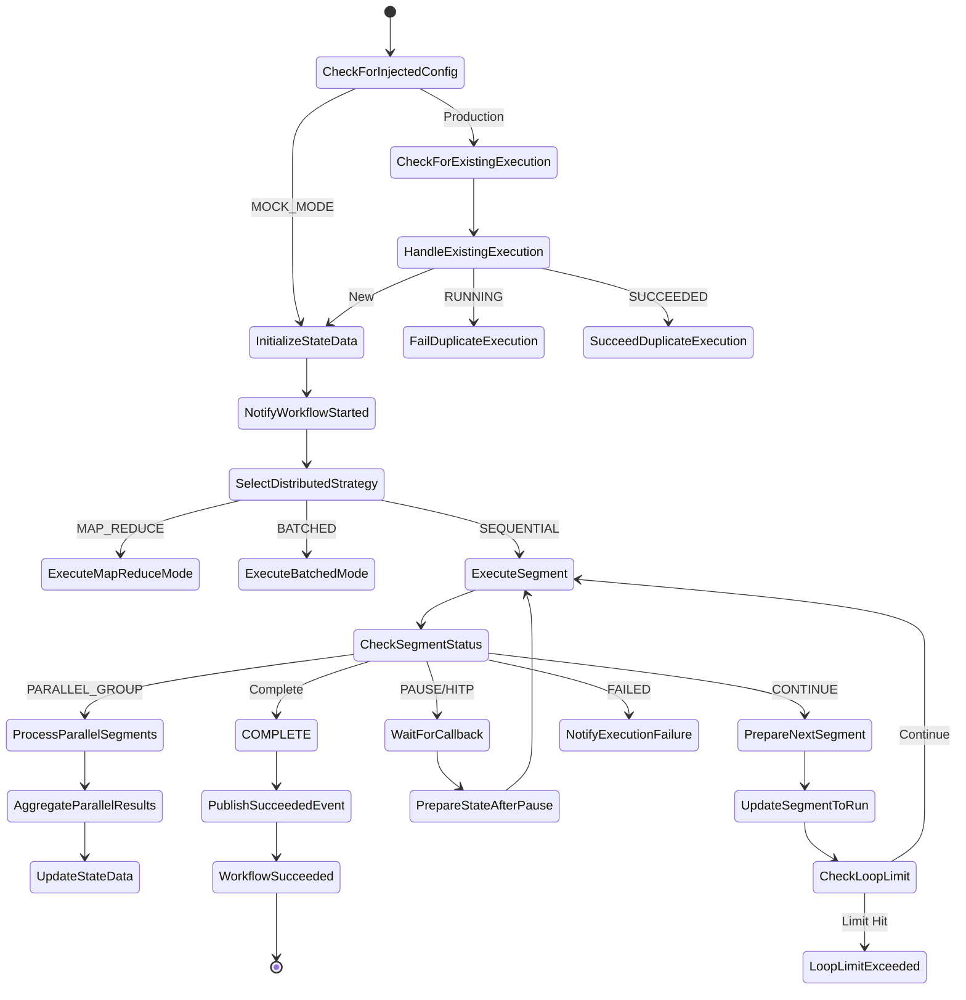

# 🏗️ Step Functions 아키텍처 분석 보고서

## 📋 목차
1. [전체 아키텍처 개요](#1-전체-아키텍처-개요)
2. [상태 머신 플로우 분석](#2-상태-머신-플로우-분석)
3. [Lambda 함수 스키마 매핑](#3-lambda-함수-스키마-매핑)
4. [데이터 흐름 및 의존성](#4-데이터-흐름-및-의존성)
5. [세그먼트화 로직 분석](#5-세그먼트화-로직-분석)
6. [문제점 및 리팩토링 권장사항](#6-문제점-및-리팩토링-권장사항)

---

## 1. 전체 아키텍처 개요

### 1.1 실행 모드
워크플로우는 3가지 실행 전략을 지원합니다:

```
┌─────────────────────────────────────────────────────────────┐
│                 SelectDistributedStrategy                    │
└───────────────────┬─────────────────────────────────────────┘
                    │
        ┌───────────┴───────────┬─────────────────────┐
        │                       │                     │
   MAP_REDUCE              BATCHED               SEQUENTIAL
   (고동시성)              (중동시성)              (순차실행)
        │                       │                     │
        ↓                       ↓                     ↓
ExecuteMapReduceMode    ExecuteBatchedMode    ExecuteSegment
  (Map State)           (Map State)           (Loop)
        │                       │                     │
        ↓                       ↓                     ↓
AggregateMapReduce     AggregateBatched      PrepareNextSegment
    Results                Results              (재귀 루프)
```

### 1.2 상태 전환 다이어그램



---

## 2. 상태 머신 플로우 분석

### 2.1 상태 분류

#### **Choice 상태 (16개)**
| 상태명 | 목적 | 다음 상태 |
|--------|------|-----------|
| `CheckForInjectedConfig` | MOCK_MODE 체크 | InitializeStateData / CheckForExistingExecution |
| `HandleIdempotencyFailure` | 멱등성 실패 처리 | InitializeStateData / FailIdempotencyUnavailable |
| `HandleExistingExecution` | 중복 실행 처리 | FailDuplicateExecution / SucceedDuplicateExecution / InitializeStateData |
| `CheckLargeWorkflow` | 대형 워크플로우 경고 | NotifyLargeWorkflowWarning / NotifyWorkflowStarted |
| `SelectDistributedStrategy` | 실행 전략 선택 | ExecuteMapReduceMode / ExecuteBatchedMode / ExecuteSegment |
| `CheckSegmentStatus` | 세그먼트 상태 확인 | 12개 분기 (CONTINUE, PARALLEL_GROUP, PAUSE, FAILED 등) |
| `PrepareNextSegment` | 다음 세그먼트 준비 | UpdateSegmentToRun / PublishSucceededEvent |
| `IsPauseNeeded` | HITP 일시정지 필요 | WaitForCallback / CheckForNextSegment |
| `CheckForNextSegment` | 다음 세그먼트 존재 확인 | PrepareNextSegment / PublishSucceededEvent |
| `CheckLoopLimit` | 무한루프 방지 | ExecuteSegment / LoopLimitExceeded |
| `CheckIfAsyncRequired` | 비동기 LLM 필요 | NotifyAsyncLLMProcessing / NotifyExecutionFailure |
| `CheckBranchNext` (Iterator 내부) | 브랜치 계속 실행 확인 | BranchComplete / UpdateBranchSegment / HandleBranchFailedStatus |
| `CheckBranchLoopLimit` (Iterator 내부) | 브랜치 루프 제한 | ExecuteBranchSegment / BranchLoopLimitExceeded |

#### **Task 상태 (21개)**

##### **Lambda 호출 (11개)**
| 상태명 | Lambda 함수 | 용도 |
|--------|-------------|------|
| `InitializeStateData` | InitializeStateDataFunction | 워크플로우 초기화, S3 경로 생성, 파티션 로딩 |
| `ExecuteSegment` | SegmentRunnerFunction | 단일 세그먼트 실행 (SEQUENTIAL 모드) |
| `MapReduceSegmentRunner` | SegmentRunnerFunction | Map-Reduce 모드 세그먼트 실행 |
| `BatchedSegmentRunner` | SegmentRunnerFunction | Batched 모드 세그먼트 실행 |
| `ExecuteBranchSegment` | SegmentRunnerFunction | 병렬 브랜치 내부 세그먼트 실행 |
| `AggregateParallelResults` | SegmentRunnerFunction | 병렬 실행 결과 집계 (aggregator type) |
| `UpdateStateData` | StateDataManagerFunction | 상태 압축 및 S3 오프로딩 |
| `WaitForCallback` | StoreTaskTokenFunction | HITP Task Token 저장 |
| `PrepareStateAfterPause` | MergeCallbackFunction | HITP 재개 후 상태 병합 |
| `HandleAsyncLLM` | AsyncLLMHandlerFunction | 비동기 LLM 처리 |
| `AggregateMapReduceResults` | AggregateResultsArn | Map-Reduce 결과 최종 집계 |
| `AggregateBatchedResults` | AggregateResultsArn | Batched 결과 최종 집계 |

##### **EventBridge 발행 (9개)**
| 상태명 | 이벤트 타입 | 용도 |
|--------|------------|------|
| `HandleInitFailure` | WorkflowLifecycleEvent (FAILED) | 초기화 실패 알림 |
| `NotifyLargeWorkflowWarning` | WorkflowLifecycleEvent (LARGE_WORKFLOW_WARNING) | 대형 워크플로우 경고 |
| `NotifyWorkflowStarted` | WorkflowLifecycleEvent (RUNNING) | 워크플로우 시작 알림 |
| `NotifyAsyncLLMProcessing` | WorkflowLifecycleEvent (ASYNC_LLM_PROCESSING) | 비동기 LLM 처리 중 알림 |
| `PublishSucceededEvent` | WorkflowLifecycleEvent (COMPLETED) | 워크플로우 완료 알림 |
| `NotifyExecutionSuccess` | WorkflowExecutionSucceeded | 최종 성공 알림 |
| `NotifyWorkflowCompleted` | WorkflowLifecycleEvent (COMPLETED) | Hybrid 모드 완료 알림 |
| `NotifyExecutionFailure` | WorkflowLifecycleEvent (FAILED) | 실행 실패 알림 |

##### **DynamoDB 직접 통합 (1개)**
| 상태명 | 작업 | 용도 |
|--------|------|------|
| `CheckForExistingExecution` | dynamodb:getItem | 멱등성 키로 기존 실행 조회 (Cold Start 최적화) |

#### **Map 상태 (3개)**
| 상태명 | 동시성 | Iterator 플로우 |
|--------|---------|-----------------|
| `ExecuteMapReduceMode` | 동적 (max_concurrency) | MapReduceSegmentRunner → End |
| `ExecuteBatchedMode` | 고정 (10) | BatchedSegmentRunner → End |
| `ProcessParallelSegments` | 동적 (max_concurrency) | InitializeBranch → ExecuteBranchSegment → (루프) → BranchComplete |

#### **Pass 상태 (11개)**
| 상태명 | 용도 |
|--------|------|
| `PrepareSequentialBranch` | inner_partition_map을 partition_map으로 교체 |
| `HandleBranchError` | Lambda 예외를 PARTIAL_FAILURE로 변환 |
| `HandleBranchFailedStatus` | FAILED 상태를 PARTIAL_FAILURE로 변환 |
| `UpdateBranchSegment` | 브랜치 다음 세그먼트 준비 |
| `UpdateBranchToSequential` | 브랜치 내 SEQUENTIAL_BRANCH 처리 |
| `BranchComplete` | 브랜치 결과 준비 |
| `HandleMapError` | Map 에러 시 빈 결과 준비 |
| `EnsureExecutionResult` | execution_result 기본값 보장 |
| `MergeExecutionResult` | 기본값과 실제값 병합 |
| `CleanupMergedState` | 페이로드 정리 (256KB 제한 회피) |
| `UpdateStateDataFallback` | 압축 실패 시 폴백 |
| `ApplyMergedState` | HITP 재개 후 상태 적용 |
| `ProcessAsyncResult` | 비동기 LLM 결과 처리 |
| `UpdateSegmentToRun` | 다음 세그먼트 인덱스 업데이트 |
| `PrepareSuccessOutput` | 최종 성공 출력 준비 |
| `PrepareHybridModeOutput` | Hybrid 모드 출력 준비 |

---

## 3. Lambda 함수 스키마 매핑

### 3.1 InitializeStateDataFunction

**입력 스키마:**
```json
{
  "input": {
    "ownerId": "string",
    "workflowId": "string",
    "workflow_config": "object (optional)",
    "workflow_config_s3_path": "string (optional)",
    "initial_state": "object (optional)",
    "idempotency_key": "string",
    "MOCK_MODE": "boolean (optional)",
    "test_workflow_config": "object (optional)",
    "quota_reservation_id": "string (optional)"
  }
}
```

**출력 스키마:**
```json
{
  "workflow_config_s3_path": "string",
  "state_s3_path": "string",
  "light_config": "object (minimal metadata)",
  "input": "object (preserved)",
  "state_history": "array",
  "ownerId": "string",
  "workflowId": "string",
  "segment_to_run": 0,
  "idempotency_key": "string",
  "quota_reservation_id": "string",
  "total_segments": "number",
  "partition_map": "array",
  "partition_map_s3_path": "string",
  "segment_manifest": "array",
  "segment_manifest_s3_path": "string",
  "max_loop_iterations": "number",
  "max_branch_iterations": "number",
  "loop_counter": 0,
  "max_concurrency": "number",
  "distributed_mode": "boolean",
  "distributed_strategy": "string",
  "llm_segments": "number",
  "hitp_segments": "number"
}
```

**SFN 사용 위치:**
- `InitializeStateData` 상태 (L135-182)

**주요 로직:**
1. workflow_config를 S3에 저장하거나 S3에서 로드
2. partition_workflow_advanced() 호출하여 세그먼트 분할
3. 초기 상태 생성 및 S3 저장
4. max_loop_iterations 동적 계산 (세그먼트 수 기반)
5. distributed_strategy 결정 (MAP_REDUCE / BATCHED / SEQUENTIAL)

---

### 3.2 SegmentRunnerFunction

**입력 스키마 (일반 실행):**
```json
{
  "workflow_config_s3_path": "string",
  "state_s3_path": "string",
  "state_history": "array (optional)",
  "ownerId": "string",
  "workflowId": "string",
  "segment_to_run": "number",
  "idempotency_key": "string",
  "quota_reservation_id": "string (optional)",
  "total_segments": "number",
  "partition_map": "array",
  "partition_map_s3_path": "string (optional)",
  "max_concurrency": "number (optional)",
  "branch_config": "object (optional, for parallel branches)",
  "test_workflow_config": "object (optional, for E2E tests)"
}
```

**입력 스키마 (Aggregator 모드):**
```json
{
  "segment_type": "aggregator",
  "parallel_results": "array[branch_result]",
  "map_error": "object (optional)",
  "workflow_config_s3_path": "string",
  "state_s3_path": "string",
  "ownerId": "string",
  "workflowId": "string",
  "segment_to_run": "number",
  "idempotency_key": "string"
}
```

**출력 스키마:**
```json
{
  "status": "CONTINUE | COMPLETE | PARALLEL_GROUP | SEQUENTIAL_BRANCH | PAUSE | PAUSED_FOR_HITP | FAILED | HALTED | SIGKILL | SKIPPED",
  "final_state": "object",
  "final_state_s3_path": "string",
  "next_segment_to_run": "number | null",
  "new_history_logs": "array",
  "error_info": "object | null",
  "branches": "array (if status=PARALLEL_GROUP)",
  "segment_type": "string",
  "inner_partition_map": "array (if status=SEQUENTIAL_BRANCH)",
  "execution_time": "number",
  "kernel_actions": "array (optional)",
  "total_segments": "number"
}
```

**SFN 사용 위치:**
- `ExecuteSegment` (L453-540) - SEQUENTIAL 모드
- `MapReduceSegmentRunner` (L329-359) - Map Iterator 내부
- `BatchedSegmentRunner` (L402-432) - Map Iterator 내부
- `ExecuteBranchSegment` (L706-793) - ProcessParallelSegments Iterator 내부
- `AggregateParallelResults` (L1034-1061) - Aggregator 모드
- `AggregateParallelResultsFromError` (L967-994) - Aggregator 모드 (에러 처리)

**주요 로직:**
1. **일반 모드**: segment_config 해석 → 워크플로우 빌드 → 실행 → 상태 저장
2. **Aggregator 모드**: 병렬 브랜치 결과 병합 → 다음 세그먼트 결정
3. **HITP 감지**: workflow_config.edges에서 inter-segment HITP 엣지 체크
4. **상태 관리**: 
   - S3 offload (>250KB)
   - Distributed Map 강제 offload (threshold=0)
   - Map branch pruning (대용량 필드 제거)

---

### 3.3 StateDataManagerFunction

**입력 스키마:**
```json
{
  "action": "update_and_compress",
  "state_data": "object (current state_data)",
  "execution_result": "object (from SegmentRunner)",
  "max_payload_size_kb": 200
}
```

**출력 스키마:**
```json
{
  "light_config": "object",
  "workflow_config_s3_path": "string",
  "state_s3_path": "string",
  "state_history": "array",
  "ownerId": "string",
  "workflowId": "string",
  "segment_to_run": "number",
  "idempotency_key": "string",
  "quota_reservation_id": "string",
  "total_segments": "number",
  "partition_map": "array | null (if offloaded)",
  "partition_map_s3_path": "string",
  "segment_manifest": "array | null (if offloaded)",
  "segment_manifest_s3_path": "string",
  "max_concurrency": "number",
  "distributed_mode": "boolean",
  "distributed_strategy": "string",
  "loop_counter": "number",
  "max_loop_iterations": "number",
  "max_branch_iterations": "number",
  "llm_segments": "number",
  "hitp_segments": "number",
  "payload_size_kb": "number",
  "compression_applied": "boolean"
}
```

**SFN 사용 위치:**
- `UpdateStateData` (L1062-1133) - 모든 세그먼트 실행 후

**주요 로직:**
1. execution_result를 state_data에 병합
2. 페이로드 크기 계산
3. 200KB 초과 시 partition_map, segment_manifest S3 오프로딩
4. state_history 업데이트
5. segment_to_run을 execution_result.next_segment_to_run으로 업데이트

---

### 3.4 StoreTaskTokenFunction

**입력 스키마:**
```json
{
  "TaskToken": "string (Step Functions Task Token)",
  "conversation_id": "string (execution ID)",
  "execution_id": "string",
  "execution_name": "string",
  "idempotency_key": "string",
  "workflow_config_s3_path": "string",
  "state_s3_path": "string",
  "segment_to_run": "number",
  "partition_map": "array",
  "total_segments": "number",
  "ownerId": "string",
  "workflowId": "string",
  "state_data": "object",
  "MOCK_MODE": "boolean (optional)"
}
```

**출력:**
- Lambda는 즉시 반환하고 내부적으로:
  1. TaskToken을 DynamoDB에 저장 (Executions-v3-dev table)
  2. EventBridge에 PAUSED 이벤트 발행 (프론트엔드 알림)

**SFN 사용 위치:**
- `WaitForCallback` (L1234-1259) - `.waitForTaskToken` 패턴

**재개 메커니즘:**
- 외부 API (`/api/v2/executions/{executionArn}/resume`)가 TaskToken과 함께 SendTaskSuccess 호출
- Step Functions가 WaitForCallback 상태에서 재개

---

### 3.5 MergeCallbackFunction

**입력 스키마:**
```json
{
  "previous_final_state": "object",
  "previous_final_state_s3_path": "string",
  "callback_result": "object (from resume API)",
  "state_data": "object",
  "segment_to_run": "number",
  "ownerId": "string",
  "workflowId": "string"
}
```

**출력 스키마:**
```json
{
  "new_current_state": "object (merged state)",
  "new_state_s3_path": "string",
  "new_state_history": "array",
  "segment_to_run": "number"
}
```

**SFN 사용 위치:**
- `PrepareStateAfterPause` (L1260-1288) - WaitForCallback 이후

**주요 로직:**
1. previous_final_state를 S3에서 로드 (S3 path인 경우)
2. callback_result와 병합
3. 새 상태를 S3에 저장
4. state_history 업데이트

---

### 3.6 AsyncLLMHandlerFunction

**입력 스키마:**
```json
{
  "TaskToken": "string",
  "execution_id": "string",
  "idempotency_key": "string",
  "workflow_config_s3_path": "string",
  "state_s3_path": "string",
  "ownerId": "string",
  "segment_to_run": "number",
  "workflowId": "string"
}
```

**출력:**
- 비동기로 LLM 처리 후 SendTaskSuccess 호출

**SFN 사용 위치:**
- `HandleAsyncLLM` (L1374-1392) - `.waitForTaskToken` 패턴

---

### 3.7 AggregateResultsArn (Distributed Results)

**입력 스키마:**
```json
{
  "map_results": "array (MAP_REDUCE 결과)",
  "batch_results": "array (BATCHED 결과)",
  "ownerId": "string",
  "workflowId": "string",
  "execution_mode": "MAP_REDUCE | BATCHED"
}
```

**출력 스키마:**
```json
{
  "final_state": "object (aggregated)",
  "status": "COMPLETE"
}
```

**SFN 사용 위치:**
- `AggregateMapReduceResults` (L360-379)
- `AggregateBatchedResults` (L433-452)

---

## 4. 데이터 흐름 및 의존성

### 4.1 핵심 데이터 구조

#### **state_data (Step Functions 컨텍스트)**
```json
{
  "workflow_config_s3_path": "s3://bucket/workflows/{workflowId}/config.json",
  "state_s3_path": "s3://bucket/workflows/{workflowId}/executions/{executionId}/state_{segmentId}.json",
  "partition_map": [
    {
      "id": 0,
      "nodes": [...],
      "edges": [],
      "type": "normal | llm | hitp | parallel_group | aggregator",
      "node_ids": ["n1", "n2"],
      "next_mode": "default | conditional | end",
      "default_next": 1
    }
  ],
  "partition_map_s3_path": "s3://... (when offloaded)",
  "total_segments": 10,
  "segment_to_run": 3,
  "loop_counter": 5,
  "max_loop_iterations": 100,
  "max_concurrency": 50,
  "distributed_strategy": "SEQUENTIAL | MAP_REDUCE | BATCHED",
  "llm_segments": 3,
  "hitp_segments": 2
}
```

#### **execution_result (SegmentRunner 출력)**
```json
{
  "status": "CONTINUE",
  "final_state": {
    "step_history": [...],
    "messages": [...],
    "query_results": [...]
  },
  "final_state_s3_path": "s3://...",
  "next_segment_to_run": 4,
  "new_history_logs": ["Segment 3 completed"],
  "error_info": null,
  "branches": null,
  "segment_type": "llm",
  "execution_time": 2.5,
  "total_segments": 10
}
```

#### **partition_map 구조**
```json
[
  {
    "id": 0,
    "type": "normal",
    "nodes": [{...}],
    "edges": [],  // ⚠️ 항상 비어있음 - intra-segment edges만 저장
    "node_ids": ["trigger_node"],
    "next_mode": "default",
    "default_next": 1
  },
  {
    "id": 1,
    "type": "llm",
    "nodes": [{...}],
    "edges": [],
    "node_ids": ["llm_node_1"],
    "next_mode": "default",
    "default_next": 2
  },
  {
    "id": 2,
    "type": "parallel_group",
    "branches": [
      {
        "branch_id": "B0",
        "partition_map": [...],  // 브랜치 내부 세그먼트
        "has_end": false,
        "target_node": "branch_start_node"
      }
    ],
    "node_ids": [],
    "branch_count": 3,
    "next_mode": "default",
    "default_next": 3  // aggregator segment
  },
  {
    "id": 3,
    "type": "aggregator",
    "nodes": [],
    "edges": [],
    "node_ids": [],
    "source_parallel_group": 2,
    "convergence_node": "merge_node",
    "next_mode": "default",
    "default_next": 4
  }
]
```

### 4.2 S3 경로 구조

```
s3://{ExecutionBucket}/
├── workflows/
│   └── {workflowId}/
│       ├── config.json                    # workflow_config
│       ├── partition_map.json             # partition_map (large workflows)
│       └── executions/
│           └── {executionId}/
│               ├── state_0.json           # 초기 상태
│               ├── state_1.json           # segment 1 실행 후
│               ├── state_2.json           # segment 2 실행 후
│               ├── state_3.json           # ...
│               ├── segment_manifest.json  # 세그먼트 목록 (distributed mode)
│               └── final_state.json       # 최종 결과
```

### 4.3 데이터 흐름 다이어그램

```
┌─────────────────────────────────────────────────────────────────┐
│                    InitializeStateDataFunction                   │
│  Input: workflow_config                                          │
│  Output: partition_map, total_segments, state_s3_path           │
└─────────────────┬───────────────────────────────────────────────┘
                  │
                  ↓ partition_map, segment_to_run=0
┌─────────────────────────────────────────────────────────────────┐
│                    ExecuteSegment (Loop)                         │
│  Input: segment_to_run, partition_map, state_s3_path           │
└─────────────────┬───────────────────────────────────────────────┘
                  │
      ┌───────────┴───────────┐
      │                       │
      ↓ CONTINUE              ↓ PARALLEL_GROUP
┌─────────────────┐    ┌────────────────────────┐
│ PrepareNext     │    │ ProcessParallelSegments│
│ Segment         │    │ (Map State)            │
└──────┬──────────┘    └──────┬─────────────────┘
       │                      │
       │                      ↓ parallel_results[]
       │               ┌──────────────────────────┐
       │               │ AggregateParallelResults │
       │               │ (SegmentRunner)          │
       │               └──────┬───────────────────┘
       │                      │
       └──────────────────────┴→
                  │
                  ↓ execution_result
┌─────────────────────────────────────────────────────────────────┐
│                    UpdateStateData                               │
│  Input: state_data, execution_result                            │
│  Output: updated state_data (with S3 offload if >200KB)        │
└─────────────────┬───────────────────────────────────────────────┘
                  │
                  ↓ state_data (segment_to_run++, loop_counter++)
┌─────────────────────────────────────────────────────────────────┐
│                    CheckLoopLimit                                │
│  If loop_counter > max_loop_iterations: FAIL                    │
│  Else: → ExecuteSegment                                         │
└─────────────────────────────────────────────────────────────────┘
```

---

## 5. 세그먼트화 로직 분석

### 5.1 파티셔닝 프로세스

```python
# partition_service.py의 partition_workflow_advanced()

1. DAG 검증 (사이클 감지)
   ↓
2. Forced segment starts 수집 (합류점 감지)
   ↓
3. run_partitioning() 재귀 호출
   ├─ 시작 노드부터 BFS 순회
   ├─ 분할 트리거:
   │  • HITP 엣지 진입 (is_hitp_start)
   │  • LLM 노드 (is_llm)
   │  • Merge point (in-degree > 1)
   │  • Branch point (out-degree > 1)
   │  • Forced start (합류점)
   │  • Inline parallel_group 노드
   ├─ 브랜치 처리:
   │  • 각 브랜치 재귀 파티셔닝
   │  • Parallel group + Aggregator 생성
   └─ flush_local(): 세그먼트 생성
   ↓
4. process_links_recursive()
   ├─ next_mode 설정 (default/conditional/end)
   ├─ Aggregator → Convergence node 연결
   └─ 브랜치 종료 검증
   ↓
5. 반환: {partition_map, total_segments, metadata}
```

### 5.2 create_segment() 로직

```python
def create_segment(nodes_map, edges_list, s_type, override_id, config):
    # 1. 노드 타입 정정 (code → operator)
    for node in nodes_map.values():
        if node.get("type") == "code":
            node["type"] = "operator"
    
    # 2. ⚠️ PROBLEM: 세그먼트 내부 엣지만 추가
    if config:
        all_edges = config.get("edges", [])
        for edge in all_edges:
            source, target = edge.get("source"), edge.get("target")
            if source in nodes_map and target in nodes_map:  # ← 양쪽 다 같은 segment에 있어야!
                edges_list.append(edge)
    
    # 3. 위상 정렬 (DynamicWorkflowBuilder는 nodes[0]을 entry point로 사용)
    sorted_nodes = _topological_sort_nodes(nodes_map, edges_list)
    
    # 4. 세그먼트 반환
    return {
        "id": seg_id,
        "nodes": sorted_nodes,
        "edges": edges_list,  # ← intra-segment edges만 포함!
        "type": s_type,
        "node_ids": [n["id"] for n in sorted_nodes]
    }
```

### 5.3 세그먼트 간 연결 (next_mode)

```python
# process_links_recursive()에서 설정

for seg in segments:
    if seg["type"] == "aggregator":
        # Aggregator는 convergence_node로 다음 세그먼트 찾기
        convergence_node = seg.get("convergence_node")
        if convergence_node in node_to_seg_map:
            next_seg_id = node_to_seg_map[convergence_node]
            seg["next_mode"] = "default"
            seg["default_next"] = next_seg_id
    else:
        # 일반 세그먼트: node_ids의 outgoing edges 확인
        exit_edges = []
        for node_id in seg["node_ids"]:
            for edge in outgoing_edges.get(node_id, []):
                target = edge.get("target")
                if target in node_to_seg_map:
                    target_seg = node_to_seg_map[target]
                    if target_seg != seg["id"]:  # 다른 세그먼트로 가는 엣지
                        exit_edges.append({"edge": edge, "target_segment": target_seg})
        
        if len(exit_edges) == 0:
            seg["next_mode"] = "end"
        elif len(exit_edges) == 1:
            seg["next_mode"] = "default"
            seg["default_next"] = exit_edges[0]["target_segment"]
        else:
            seg["next_mode"] = "conditional"
            seg["branches"] = [...]
```

**⚠️ 문제점:**
- `exit_edges`를 수집하지만 엣지의 **타입 정보**는 무시됨
- HITP, loop_exit, conditional 같은 메타데이터 손실
- `next_mode`는 단순히 개수만 기반으로 결정 (1개=default, 여러개=conditional)

---

## 6. 문제점 및 리팩토링 권장사항

### 6.1 🔴 Critical Issues

#### **Issue 1: Inter-Segment 엣지 정보 완전 손실**

**현재 상황:**
- `partition_map[i].edges`는 항상 비어있음 (intra-segment edges만 저장)
- segment 간 연결은 `next_mode`/`default_next`로만 표현
- HITP, loop_exit, conditional routing 정보 모두 손실

**영향:**
```python
# partition_service.py L330-340
if source in nodes_map and target in nodes_map:  # ← 문제!
    edges_list.append(edge)

# 결과:
# Segment 0 (node A) → HITP edge → Segment 1 (node B)
# → HITP 엣지 정보가 partition_map에 저장 안됨!
```

**현재 우회 솔루션:**
```python
# segment_runner_service.py (4개 지점에 중복 코드)
workflow_config = event.get('workflow_config')
edges = workflow_config.get('edges', [])
for edge in edges:
    if (edge.get('source') in current_node_ids and 
        edge.get('target') in next_node_ids and
        edge.get('type') in {'hitp', 'human_in_the_loop', 'pause'}):
        hitp_detected = True
        break
```

**문제점:**
- ✅ HITP는 감지됨
- ❌ loop_exit는 체크 안함
- ❌ conditional routing 정보 없음
- ❌ 매번 전체 workflow_config 스캔 (O(E) 성능 저하)
- ❌ 4개 지점에 중복 코드 (유지보수 비용)

---

#### **Issue 2: partition_map 스키마의 불완전성**

**현재 partition_map 구조:**
```json
{
  "id": 1,
  "nodes": [...],
  "edges": [],  // ← 항상 비어있음
  "type": "normal",
  "node_ids": ["n1", "n2"],
  "next_mode": "default",
  "default_next": 2  // ← 엣지 메타데이터 없음!
}
```

**문제:**
1. `default_next`는 정수 ID만 저장 → 엣지 타입/조건 정보 없음
2. `next_mode: "conditional"`일 때도 조건 표현식 저장 안됨
3. Loop exit 엣지와 일반 엣지 구분 불가

---

#### **Issue 3: 상태 머신의 복잡도**

**통계:**
- 총 상태: 55개
- Choice 상태: 16개 (복잡한 분기 로직)
- Lambda 호출: 11개 (다양한 함수)
- EventBridge 발행: 9개 (알림 과부하)
- Map 상태: 3개 (중첩된 병렬 처리)

**문제:**
1. **유지보수 어려움**: 55개 상태의 흐름 추적 어려움
2. **디버깅 복잡성**: 어느 상태에서 에러났는지 파악하기 어려움
3. **성능 오버헤드**: EventBridge 9번 호출 (알림마다 Lambda trigger)
4. **상태 이름 중복**: `NotifyWorkflowStarted`, `NotifyWorkflowCompleted`, `NotifyExecutionSuccess` 등 유사 기능

---

#### **Issue 4: 데이터 전달 패턴의 일관성 부족**

**Case 1: ExecuteSegment → CheckSegmentStatus**
```json
// ResultPath: "$.execution_result"
{
  "state_data": {...},
  "execution_result": {
    "status": "CONTINUE",
    "final_state": {...},
    "next_segment_to_run": 2
  }
}
```

**Case 2: ProcessParallelSegments → AggregateParallelResults**
```json
// ResultPath: "$.parallel_results"
{
  "state_data": {...},
  "parallel_results": [...]  // ← 다른 이름!
}
```

**Case 3: WaitForCallback → PrepareStateAfterPause**
```json
// ResultPath: "$.callback_result"
{
  "state_data": {...},
  "execution_result": {...},
  "callback_result": {...}  // ← 또 다른 이름!
}
```

**문제:**
- 일관되지 않은 필드명 (`execution_result`, `parallel_results`, `callback_result`)
- Choice 상태에서 경로가 달라져 JSON Path 복잡해짐
- 에러 처리 시 어떤 필드를 참조해야 할지 혼란

---

#### **Issue 5: S3 Offload 로직 중복**

**4곳에서 동일 로직 반복:**
1. `segment_runner_service.py` L3139-3147 (Partial Failure)
2. `segment_runner_service.py` L3353-3361 (E2E Test)
3. `segment_runner_service.py` L3377-3385 (Final Segment)
4. `segment_runner_service.py` L3405-3413 (Continue)

```python
# 중복 코드 (4번 반복)
response_final_state = final_state
if output_s3_path:
    response_final_state = {
        "__s3_offloaded": True,
        "__s3_path": output_s3_path,
        "__original_size_kb": len(json.dumps(final_state, ...)) / 1024
    }
    logger.info(f"[S3 Offload] Replaced final_state...")
```

---

### 6.2 🟡 Medium Priority Issues

#### **Issue 6: Loop Counter의 이중 관리**

**Step Functions 레벨:**
```json
{
  "state_data": {
    "loop_counter": 5,
    "max_loop_iterations": 100
  }
}
```

**Lambda 레벨 (segment_runner):**
```python
# Parallel branch iterator에서 별도 loop_counter
loop_counter = event.get('loop_counter', 0)
# Loop exit 조건도 별도 관리
```

**문제:**
- SFN과 Lambda에서 각각 루프 카운팅
- max_branch_iterations vs max_loop_iterations 혼란
- 브랜치 내부 루프는 SFN 루프 카운트에 포함 안됨

---

#### **Issue 7: 에러 핸들링의 불일치**

**Case 1: ExecuteSegment Catch**
```json
{
  "ErrorEquals": ["States.ALL"],
  "ResultPath": "$.execution_result.error_info",
  "Next": "NotifyExecutionFailure"
}
```

**Case 2: ExecuteBranchSegment Catch**
```json
{
  "ErrorEquals": ["States.ALL"],
  "ResultPath": "$.branch_error",
  "Next": "HandleBranchError"
}
```

**Case 3: UpdateStateData Catch**
```json
{
  "ErrorEquals": ["States.ALL"],
  "ResultPath": "$.compression_error",
  "Next": "UpdateStateDataFallback"
}
```

**문제:**
- 에러 저장 경로 불일치 (`.execution_result.error_info`, `.branch_error`, `.compression_error`)
- 일부는 즉시 실패, 일부는 폴백 처리
- 에러 복구 전략 불명확

---

#### **Issue 8: Distributed Mode 선택 로직 불투명**

```python
# InitializeStateDataFunction에서 결정
if total_segments > 200:
    distributed_strategy = "MAP_REDUCE"
elif total_segments > 50:
    distributed_strategy = "BATCHED"
else:
    distributed_strategy = "SEQUENTIAL"
```

**문제:**
1. 하드코딩된 임계값 (50, 200)
2. 워크플로우 특성 무시 (LLM 비중, HITP 여부, 그래프 복잡도)
3. 사용자 override 불가

---

### 6.3 🟢 Low Priority Issues

#### **Issue 9: EventBridge 발행 남발**

**9개 상태에서 발행:**
- HandleInitFailure
- NotifyLargeWorkflowWarning
- NotifyWorkflowStarted
- NotifyAsyncLLMProcessing
- PublishSucceededEvent
- NotifyExecutionSuccess
- NotifyWorkflowCompleted
- NotifyExecutionFailure

**문제:**
- 대부분 알림 목적
- 일부는 중복 (PublishSucceededEvent + NotifyExecutionSuccess)
- EventBridge → Lambda → WebSocket 경로로 오버헤드

---

#### **Issue 10: Pass 상태 과다 사용**

**11개 Pass 상태:**
- 대부분 Parameters 변환 용도
- Lambda에서 처리 가능한 로직도 포함

**예시:**
```json
// UpdateSegmentToRun (L1490-1527)
{
  "Type": "Pass",
  "Parameters": {
    "segment_to_run.$": "$.execution_result.next_segment_to_run",
    "loop_counter.$": "States.MathAdd($.state_data.loop_counter, 1)",
    ...
  }
}
```

→ Lambda에서 처리하면 SFN 상태 1개 줄일 수 있음

---

## 7. 리팩토링 권장사항

### 7.1 🎯 Phase 1: Critical Fixes (P0)

#### **1.1 Partition Map 스키마 확장**

**새 스키마:**
```json
{
  "id": 1,
  "nodes": [...],
  "edges": [],  // intra-segment edges
  "outgoing_edges": [  // ← NEW: inter-segment edges
    {
      "source_node": "node_in_this_segment",
      "target_node": "node_in_next_segment",
      "target_segment": 2,
      "edge_type": "hitp",
      "condition": null,
      "is_loop_exit": false,
      "metadata": {
        "label": "Human Review",
        "style": "dashed"
      }
    }
  ],
  "type": "llm",
  "node_ids": ["llm_node"],
  "next_mode": "default",
  "default_next": 2
}
```

**구현:**
```python
# partition_service.py - create_segment() 수정

def create_segment(nodes_map, edges_list, s_type, override_id, config):
    # ... 기존 코드 ...
    
    # [NEW] Inter-segment edges 수집
    outgoing_edges = []
    if config:
        all_edges = config.get("edges", [])
        for edge in all_edges:
            source = edge.get("source")
            target = edge.get("target")
            
            # Intra-segment edge
            if source in nodes_map and target in nodes_map:
                edges_list.append(edge)
            
            # Inter-segment edge
            elif source in nodes_map and target not in nodes_map:
                outgoing_edges.append({
                    "source_node": source,
                    "target_node": target,
                    "edge_type": edge.get("type", "normal"),
                    "condition": edge.get("condition"),
                    "is_loop_exit": edge.get("data", {}).get("isLoopExit", False),
                    "metadata": {
                        "label": edge.get("label"),
                        "style": edge.get("style"),
                        "animated": edge.get("animated")
                    }
                })
    
    return {
        "id": seg_id,
        "nodes": sorted_nodes,
        "edges": edges_list,
        "outgoing_edges": outgoing_edges,  # ← NEW
        "type": s_type,
        "node_ids": [...]
    }
```

**segment_runner_service.py 수정:**
```python
# HITP 감지 로직 간소화

def check_inter_segment_edges(segment_config, next_segment_config):
    """
    현재 세그먼트의 outgoing_edges에서 다음 세그먼트로 가는 엣지 정보 추출
    """
    outgoing_edges = segment_config.get("outgoing_edges", [])
    next_node_ids = set(next_segment_config.get("node_ids", []))
    
    for edge in outgoing_edges:
        if edge["target_node"] in next_node_ids:
            return {
                "edge_type": edge["edge_type"],
                "is_loop_exit": edge["is_loop_exit"],
                "condition": edge["condition"],
                "metadata": edge["metadata"]
            }
    
    return None

# 사용:
edge_info = check_inter_segment_edges(current_seg, next_seg)
if edge_info and edge_info["edge_type"] in {"hitp", "human_in_the_loop", "pause"}:
    return {"status": "PAUSED_FOR_HITP", ...}
```

**장점:**
- ✅ workflow_config 스캔 불필요 (O(E) → O(1))
- ✅ 4곳 중복 코드 → 1개 함수로 통합
- ✅ loop_exit, conditional 지원
- ✅ 엣지 메타데이터 보존

---

#### **1.2 State Data Manager 통합**

**현재 문제:**
- UpdateStateData Lambda (L1062-1133)
- UpdateStateDataFallback Pass (L1134-1173)
- 거의 동일한 Parameters 블록 (40줄 중복)

**제안:**
```json
// StateDataManagerFunction 응답 표준화
{
  "state_data": {  // ← 직접 state_data 반환
    "workflow_config_s3_path": "...",
    "state_s3_path": "...",
    "segment_to_run": "...",
    ...
  }
}

// SFN에서 사용
{
  "Type": "Task",
  "Resource": "StateDataManagerArn",
  "ResultPath": "$.state_data",  // ← 직접 교체
  "Next": "IsPauseNeeded"
}
```

**Fallback 제거:**
- Lambda 내부에서 에러 처리
- 압축 실패 시 원본 그대로 반환
- SFN 폴백 상태 불필요

---

#### **1.3 Execution Result 구조 표준화**

**표준 응답 인터페이스:**
```typescript
interface ExecutionResult {
  status: 'CONTINUE' | 'COMPLETE' | 'PARALLEL_GROUP' | 'PAUSE' | 'FAILED';
  final_state: object;
  final_state_s3_path: string;
  next_segment_to_run?: number;
  error_info?: object;
  // 타입별 optional 필드
  branches?: Array<BranchConfig>;  // PARALLEL_GROUP
  inner_partition_map?: Array<Segment>;  // SEQUENTIAL_BRANCH
  routing_info?: {  // ← NEW
    inter_segment_edge?: InterSegmentEdge;
    requires_hitp: boolean;
    requires_loop_exit: boolean;
    conditional_routes?: Array<ConditionalRoute>;
  };
}
```

**모든 Lambda가 동일 구조 반환:**
- ExecuteSegment
- MapReduceSegmentRunner
- BatchedSegmentRunner
- ExecuteBranchSegment
- AggregateParallelResults

**SFN ResultPath 표준화:**
```json
{
  "ResultPath": "$.execution_result"  // ← 항상 동일
}
```

---

### 7.2 🔄 Phase 2: Refactoring (P1)

#### **2.1 상태 머신 간소화**

**현재:** 55개 상태
**목표:** 35개 이하

**통합 가능한 상태:**

1. **알림 상태 통합 (9→3개)**
```json
{
  "NotifyLifecycleEvent": {
    "Type": "Task",
    "Resource": "arn:aws:states:::events:putEvents",
    "Parameters": {
      "Entries": [{
        "Detail": {
          "status.$": "$.notification.status",
          "message.$": "$.notification.message",
          ...
        }
      }]
    }
  }
}
```

- NotifyWorkflowStarted → NotifyLifecycleEvent (status=RUNNING)
- PublishSucceededEvent → NotifyLifecycleEvent (status=COMPLETED)
- NotifyExecutionFailure → NotifyLifecycleEvent (status=FAILED)

2. **에러 핸들러 통합 (3→1개)**
```json
{
  "HandleExecutionError": {
    "Type": "Pass",
    "Parameters": {
      "status": "PARTIAL_FAILURE",
      "error_source.$": "$.error_source",
      "error_info.$": "States.JsonMerge($.default_error, $.actual_error, false)"
    }
  }
}
```

- HandleBranchError → HandleExecutionError
- HandleBranchFailedStatus → HandleExecutionError
- HandleMapError → HandleExecutionError

3. **상태 업데이트 통합 (3→1개)**
```json
{
  "PrepareNextIteration": {
    "Type": "Task",
    "Resource": "PrepareIterationArn",  // 새 Lambda
    "Parameters": {
      "iteration_type.$": "$.iteration_type",  // segment/branch/async
      "current_state.$": "$.state_data",
      "execution_result.$": "$.execution_result"
    }
  }
}
```

- UpdateSegmentToRun → PrepareNextIteration (type=segment)
- UpdateBranchSegment → PrepareNextIteration (type=branch)
- ProcessAsyncResult → PrepareNextIteration (type=async)

---

#### **2.2 Loop Counter 단일화**

**현재:**
```json
{
  "state_data": {
    "loop_counter": 5,
    "max_loop_iterations": 100,
    "max_branch_iterations": 50
  },
  "branch_state": {
    "loop_counter": 2  // ← 별도 관리!
  }
}
```

**제안:**
```json
{
  "state_data": {
    "iteration_stack": [
      {"type": "main", "counter": 5, "max": 100},
      {"type": "branch", "counter": 2, "max": 50},
      {"type": "nested_loop", "counter": 0, "max": 10}
    ]
  }
}
```

**Lambda 함수:**
```python
def push_iteration_context(stack, type, max):
    stack.append({"type": type, "counter": 0, "max": max})

def pop_iteration_context(stack):
    return stack.pop()

def increment_iteration(stack):
    stack[-1]["counter"] += 1
    return stack[-1]["counter"] > stack[-1]["max"]  # exceeded?
```

---

#### **2.3 Distributed Strategy 선택 개선**

**현재:** 하드코딩된 임계값 (50, 200)

**제안:**
```python
def calculate_complexity_score(partition_result):
    """
    워크플로우 복잡도 점수 계산 (0-100)
    """
    total_segments = partition_result["total_segments"]
    llm_segments = partition_result["llm_segments"]
    hitp_segments = partition_result["hitp_segments"]
    parallel_groups = partition_result["parallel_groups"]
    total_branches = partition_result["total_branches"]
    
    # 가중치 기반 점수
    score = (
        total_segments * 1.0 +
        llm_segments * 2.0 +  # LLM은 느리므로 가중치 높음
        hitp_segments * 0.5 +  # HITP는 대기 시간이므로 가중치 낮음
        parallel_groups * 3.0 +  # 병렬 그룹은 복잡도 높음
        total_branches * 1.5
    )
    
    return min(score, 100)

def select_strategy(complexity_score, user_preference=None):
    """
    복잡도 점수 기반 전략 선택
    """
    if user_preference:
        return user_preference
    
    if complexity_score > 70:
        return "MAP_REDUCE"  # 고복잡도: 최대 동시성
    elif complexity_score > 30:
        return "BATCHED"  # 중복잡도: 제어된 동시성
    else:
        return "SEQUENTIAL"  # 저복잡도: 순차 실행
```

---

### 7.3 🚀 Phase 3: 최적화 (P2)

#### **3.1 S3 Offload 헬퍼 함수화**

**공통 함수:**
```python
# common/s3_offload_helper.py

def prepare_response_with_offload(final_state, output_s3_path, threshold_kb=250):
    """
    S3 offload 시 응답 페이로드 최소화
    """
    if not output_s3_path:
        return final_state
    
    state_size = len(json.dumps(final_state, ensure_ascii=False).encode('utf-8'))
    
    if state_size < threshold_kb * 1024:
        return final_state  # 작으면 그대로
    
    # 큰 상태는 메타데이터만
    return {
        "__s3_offloaded": True,
        "__s3_path": output_s3_path,
        "__original_size_kb": state_size / 1024
    }
```

**사용:**
```python
# segment_runner_service.py

response_final_state = prepare_response_with_offload(
    final_state, 
    output_s3_path
)

return {
    "status": "COMPLETE",
    "final_state": response_final_state,
    ...
}
```

---

#### **3.2 Partition Map 캐싱**

**현재:** 매번 S3에서 로드

**제안:**
```python
# Lambda Layer에 캐싱 로직 추가

import hashlib
from functools import lru_cache

@lru_cache(maxsize=100)
def get_partition_map_cached(partition_map_s3_path):
    """
    partition_map을 메모리 캐시 (Lambda 재사용 시)
    """
    key = hashlib.md5(partition_map_s3_path.encode()).hexdigest()
    return s3.get_object(Bucket=bucket, Key=key)

# 사용
partition_map = get_partition_map_cached(partition_map_s3_path)
```

**효과:**
- 동일 실행 내 반복 호출 시 S3 GET 0회
- Lambda warm start 시 캐시 유지

---

#### **3.3 EventBridge → SQS 비동기 처리**

**현재:** EventBridge → Lambda → WebSocket (동기)

**제안:**
```
EventBridge → SQS → Lambda (Batch) → WebSocket (비동기)
```

**장점:**
- 알림 지연 허용 (0.5~1초)
- Lambda 호출 횟수 감소 (배칭)
- 실패 재시도 자동 처리

---

## 8. 마이그레이션 계획

### 8.1 Phase 1 구현 (Critical - 2주)

**Week 1: Partition Map 스키마 확장**
- Day 1-2: `create_segment()` 수정 및 테스트
- Day 3-4: `segment_runner_service.py` HITP 감지 로직 교체
- Day 5: 통합 테스트 (HITP, loop_exit, conditional)

**Week 2: State Data 구조 표준화**
- Day 1-2: ExecutionResult 인터페이스 정의
- Day 3-4: 모든 Lambda 함수 응답 수정
- Day 5: SFN ResultPath 표준화 및 테스트

### 8.2 Phase 2 구현 (Refactoring - 3주)

**Week 3-4: 상태 머신 간소화**
- 알림 상태 통합 (3일)
- 에러 핸들러 통합 (3일)
- 상태 업데이트 통합 (4일)

**Week 5: Loop Counter 및 Strategy 개선**
- iteration_stack 구현 (2일)
- complexity_score 계산 (2일)
- 통합 테스트 (1일)

### 8.3 Phase 3 구현 (최적화 - 1주)

**Week 6: 성능 최적화**
- S3 Offload 헬퍼 (1일)
- Partition Map 캐싱 (2일)
- EventBridge → SQS (2일)

---

## 9. 결론

### 9.1 핵심 문제 요약

1. **⚠️ CRITICAL**: Inter-segment 엣지 정보 손실
   - HITP, loop_exit, conditional routing 불가
   - 매번 전체 workflow_config 스캔 (성능 저하)

2. **⚠️ HIGH**: 상태 머신 복잡도 과다
   - 55개 상태, 16개 Choice, 9개 EventBridge
   - 디버깅 및 유지보수 어려움

3. **⚠️ MEDIUM**: 데이터 구조 불일치
   - execution_result vs parallel_results vs callback_result
   - Loop counter 이중 관리
   - S3 offload 로직 4곳 중복

### 9.2 리팩토링 우선순위

| 우선순위 | 항목 | 예상 시간 | ROI |
|---------|------|----------|-----|
| **P0** | Partition Map 스키마 확장 | 1주 | 🔥 매우 높음 (핵심 기능) |
| **P0** | ExecutionResult 표준화 | 1주 | 🔥 높음 (일관성) |
| **P1** | 상태 머신 간소화 | 2주 | 🔥 높음 (유지보수) |
| **P1** | Loop Counter 단일화 | 1주 | 🔥 중간 (정확성) |
| **P1** | Strategy 선택 개선 | 3일 | 🔥 중간 (성능) |
| **P2** | S3 Offload 헬퍼 | 1일 | 🔥 낮음 (코드 정리) |
| **P2** | Partition Map 캐싱 | 2일 | 🔥 중간 (성능) |
| **P2** | EventBridge → SQS | 2일 | 🔥 낮음 (비용 절감) |

### 9.3 권장 실행 계획

**즉시 시작 (이번 주):**
- [ ] Partition Map 스키마 확장 설계
- [ ] Inter-segment edge 정보 추출 로직 작성
- [ ] segment_runner HITP 감지 로직 교체

**단기 (2주 내):**
- [ ] ExecutionResult 표준화
- [ ] SFN ResultPath 통일
- [ ] 통합 테스트 및 배포

**중기 (1개월 내):**
- [ ] 상태 머신 간소화 (55개 → 35개)
- [ ] Loop counter 단일화
- [ ] Distributed strategy 개선

**장기 (2개월 내):**
- [ ] 성능 최적화 (캐싱, 비동기 처리)
- [ ] 모니터링 대시보드 구축
- [ ] 문서화 및 운영 가이드 작성

---

**생성일**: 2026-01-29  
**버전**: 1.0  
**작성자**: Architecture Analysis Tool
