# ☁️ GCP Migration & Enterprise Security Strategy

> [← Back to Main README](../README.md)

Analemma OS is architected with a strict **Kernel / Driver separation**, ensuring that while the reference implementation runs on AWS, the core logic is fully portable to **Google Cloud Platform (GCP)**.

This document outlines the technical path for GCP migration and the security benefits of Virtual Private Cloud (VPC) deployment.

---

## 1. Cloud Agnostic Kernel Architecture

The Analemma Kernel operates on abstract interfaces, not direct service calls. This "Hardware Abstraction Layer" (HAL) allows for seamless infrastructure swapping.

```mermaid
flowchart TB
    subgraph Kernel["⚙️ Analemma Kernel (Python)"]
        Logic[Agent Logic]
        State[State Bag Manager]
        Router[Model Router]
    end
    
    subgraph HAL["🔌 Hardware Abstraction Layer"]
        I_Compute[IComputeProvider]
        I_Storage[IStorageProvider]
        I_Queue[IMessageQueue]
    end
    
    subgraph AWS["AWS Implementation"]
        Lambda[AWS Lambda]
        S3[Amazon S3]
        SQS[Amazon SQS]
    end
    
    subgraph GCP["GCP Implementation"]
        Run[Google Cloud Run]
        GCS[Google Cloud Storage]
        PubSub[Cloud Pub/Sub]
    end
    
    Kernel --> HAL
    HAL -.-> AWS
    HAL -.-> GCP
```



---

## 2. GCP Service Mapping Strategy

Migrating Analemma to GCP leverages Google's superior containerization and AI integration capabilities.

| Kernel Component | AWS Service | GCP Target Service | Migration Advantage |
|------------------|-------------|--------------------|---------------------|
| **Orchestrator** | Step Functions | **Cloud Workflows** | Lower latency, native JSON support, better pricing for high-volume steps. |
| **Compute** | Lambda | **Cloud Run** | No 15-min timeout limit (ideal for long-running agents), built-in concurrency. |
| **State Storage** | S3 | **Cloud Storage (GCS)** | Identical generic object interface; seamless integration with Vertex AI. |
| **Database** | DynamoDB | **Firestore** | Native document store perfectly matches the JSON-based State Bag model. |
| **AI Engine** | Bedrock/Vertex | **Vertex AI (Native)** | **No Migration Needed**. The kernel is already Vertex-native. |
| **Events** | EventBridge | **Eventarc** | Standardized CloudEvents format simplifies event routing. |

### 2.1 Orchestration Mapping (Step Functions → Cloud Workflows)

**Core Concept**: Replace AWS Step Functions state machine logic with GCP Cloud Workflows YAML.

| AWS Component | GCP Component | Migration Strategy |
|---------------|---------------|--------------------|
| State Machine (ASL) | Cloud Workflow (YAML) | Convert JSON ASL to YAML. Logic is similar (Step-based). |
| Map State | `parallel` / iteration | Use Cloud Workflows `parallel` step or `for` loop. |
| Wait State | `sys.sleep` | Direct mapping. |
| Choice State | `switch` | Direct mapping. |
| Error Handling | `try/except` | Cloud Workflows has robust error handling blocks. |

> **Pro Tip**: GCP Workflows natively supports larger variable sizes (up to 512KB) and more flexible JSON manipulation than ASL. This makes it the **optimal environment** for Analemma's Zero-Gravity architecture, allowing for cleaner implementation with less boilerplate code for state management.

---

## 3. VPC Deployment & Security Engineering

Deploying Analemma OS within a **Google Cloud VPC (Virtual Private Cloud)** unlocks enterprise-grade security and performance tuning capabilities.

### 3.1 Private Service Connect (PSC) Architecture

By isolating the Kernel in a VPC, we ensure that **no data ever traverses the public internet**.

```mermaid
flowchart LR
    subgraph VPC["🔒 Corporate VPC (Private Network)"]
        Run[Cloud Run (Kernel)]
        Store[Firestore (State)]
        
        subgraph PSC["Private Service Connect"]
            Vertex[Vertex AI Endpoint]
        end
        
        Run <--> Store
        Run <--> Vertex
    end
    
    Internet((Public Internet))
    VPC --x Internet
```

### 3.2 Security Benefits

1.  **Data Sovereignty**: Agent memory (State Bag) stays strictly within the user's defined region and VPC.
2.  **No Public IPs**: Cloud Run instances operate as internal-only services, accessible only via internal Load Balancers or VPN.
3.  **VPC Service Controls**: Prevents exfiltration of training data or prompt logs to unauthorized Google services.

### 3.3 Performance Tuning via VPC

Running in a VPC allows for **Model Tuning** and **Low-Latency Indexing**:

*   **Private Fine-Tuning**: You can fine-tune Gemini 1.5 Pro on your proprietary codebase using Vertex AI Pipelines *inside* the VPC. The weights never leave your perimeter.
*   **Vector Search Acceleration**: Interaction with Vertex AI Vector Search is significantly faster (sub-5ms) over private VPC peering compared to public API calls.

---

## 4. Conclusion

Analemma OS is "Cloud Native" but "Vendor Agnostic" in design. While currently deployed on AWS for broad accessibility, a migration to **GCP + Cloud Run + Vertex AI** represents the **optimal state** for this architecture, offering:

1.  **Unified AI Stack** (Kernel & Model on the same platform).
2.  **Superior Long-Running Jobs** (Cloud Run > Lambda).
3.  **Enterprise Security** (VPC Service Controls).

This architecture is ready for immediate "Lift & Shift" to Google Cloud.
