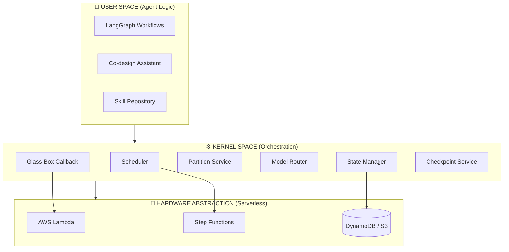
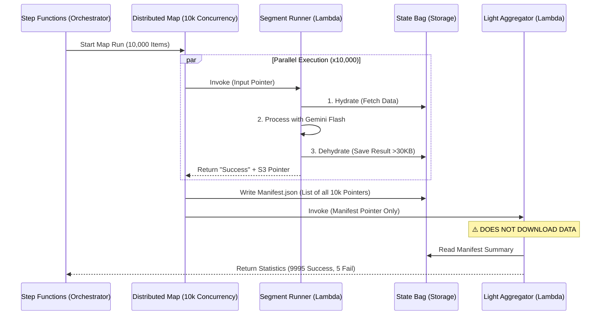

# Architecture Deep-Dive

> [← Back to Main README](../README.md)

This document provides a comprehensive technical overview of the Analemma OS kernel architecture, abstraction layers, and core implementation patterns.

---

## Table of Contents

1. [System Architecture Overview](#1-system-architecture-overview)
2. [Kernel Layer Design](#2-kernel-layer-design)
3. [State Management System](#3-state-management-system)
4. [Workflow Execution Engine](#4-workflow-execution-engine)
5. [Distributed Execution (Distributed Map)](#5-distributed-execution-distributed-map)
6. [Gemini Cognitive Engine](#6-gemini-cognitive-engine)
7. [Glass-Box Observability](#7-glass-box-observability)
8. [v3.3 State Architecture](#8-v33-state-architecture)

---

## 1. System Architecture Overview

Analemma OS is built on a **3-Layer Kernel Model** that separates concerns between agent logic, orchestration, and infrastructure:



---

## 2. Kernel Layer Design

### 2.1 Handler Pattern: Thin Controllers

Analemma follows the **"Tiny Handler"** pattern where Lambda handlers are thin routing layers that delegate all business logic to services.

### 2.2 Service Layer Responsibilities

| Service | Responsibility |
|---------|----------------|
| `OrchestratorService` | Workflow validation, graph building, execution management |
| `SegmentRunnerService` | Individual segment execution with Tiny Handler pattern |
| `StateHydrator` | **Virtual Memory Manager**: Handles S3 offloading/hydration |
| `DistributedChunkService` | Managing massive parallel execution chunks |

---

## 3. State Management System

### 3.1 StateBag: Single Source of Truth

The `StateBag` module provides kernel-level state protection and normalization. It ensures that "Kernel Protected Fields" (like `execution_id`, `owner_id`) are never overwritten by user logic.

### 3.2 Zero-Gravity State Bag Architecture

Most serverless architectures fail at scale because they try to hold state in memory. Analemma employs a **"Zero-Gravity"** architecture where the kernel payload contains no actual data, only pointers.

**Principles:**
1.  **No Data At Root**: The Step Functions payload root contains ONLY `s3://` pointers and metadata.
2.  **Strict Dehydration**: Every Lambda actively offloads results >30KB to S3 immediately.
3.  **Surgical Hydration**: Handlers download only the specific state shards they need (Input, Config, or Logs).

#### 📊 Payload Size Decision Tree: The "Analemma Golden Ratio"

Analemma defines **30KB** as the **"Golden Ratio"** for inline payloads. This is meticulously calculated based on:
1.  **Step Functions Transition Overhead**: Keeping payloads under 30KB ensures **<10ms** transition latency.
2.  **API Gateway Limits**: It fits comfortably within the **128KB WebSocket frame limit** (even with protocol overhead), ensuring real-time streams never fragmentation.

```
┌─────────────────────────────────────────────────────────────────┐
│                 Payload Size Decision Tree                       │
├─────────────────────────────────────────────────────────────────┤
│                                                                  │
│   State Payload                                                  │
│       │                                                          │
│       ├── < 30KB ───→ ✅ Inline (Optimized)                     │
│       │                  Latency: ~5ms                           │
│       │                  Strategy: "Analemma Golden Ratio"       │
│       │                                                          │
│       └── > 30KB ───→ 📦 S3 Offload (Dehydration)               │
│                         Latency: +50ms                           │
│                         Purpose: Infinite Context Preservation   │
│                                                                  │
└─────────────────────────────────────────────────────────────────┘
```

This architecture allows Analemma to handle **infinite state** (gigabytes of code context) while maintaining a sub-10KB footprint in the orchestration layer.

---

## 4. Workflow Execution Engine

The core execution is driven by AWS Step Functions. Workflows are partitioned into **segments** at LLM or HITP boundaries to optimize compute usage and checkpointing.

### 4.4 The "Immortal Kernel": Self-Healing & Partial Success

Analemma is designed to be **Immortal**. Even if individual agents or tools fail, the Kernel survives to ensure enterprise-grade reliability:

1.  **Self-Healing**: When a segment fails, the Kernel asks Gemini 3 Pro to analyze the traceback. It injects a "Fix Instruction" and retries the segment automatically.
2.  **Partial Success Patterns**: In Distributed Maps, if 5 out of 10,000 chunks fail, the system aggregates the 9,995 successes and marks the execution as `COMPLETED_WITH_RISK`. 
    - **Business Value**: A 99.9% successful batch job should not fail the entire pipeline. The Kernel ensures the "Mission" is completed.

---

## 5. Distributed Execution (Distributed Map)

For large workflows (300+ segments), Analemma uses AWS Step Functions Distributed Map.

### 5.1 Chunking Algorithm
Segments are split into chunks (`chunk_0001`, `chunk_0002`...) to balance parallelism and overhead.

### 5.2 ResultWriter Integration
We utilize Step Functions `ResultWriter` to pipe outputs directly to S3, bypassing the orchestration payload limit.

### 5.3 Manifest-Only Aggregation (Visual Flow)

The following diagram illustrates how Analemma handles the "Data Explosion" using a Pointer-Only flow.



When processing 10,000+ chunks, merging results inline causes a "Payload Explosion". Analemma uses a **Manifest-Only** strategy.

1.  **ResultWriter Output**: Step Functions writes individual chunk successes/failures directly to S3.
2.  **Manifest Generation**: Step Functions generates a `manifest.json` listing all output files.
3.  **Light Aggregator**: The reducer Lambda downloads **only the manifest**.
    - It creates a statistical summary (Success: X, Fail: Y).
    - It passes the `manifest_s3_path` to the final state.
    - **It DOES NOT download the actual results.**

This ensures that aggregating 1 million items costs the same memory as aggregating 1 item.

---

## 6. Gemini Cognitive Engine

Analemma is built natively on **Google Vertex AI** to enable capabilities that traditional LLMs cannot support.

### 6.1 Why Gemini? (The Cognitive Core)
The "State Bag" often grows to 500,000+ tokens when including full codebases and logs.

| Gemini Feature | Analemma Application |
|----------------|----------------------|
| **2M+ Token Window** | **Whole-State Reasoning (Zero-Amnesia)**:<br>Unlike RAG systems that "chunk" and lose context, Analemma feeds **10,000+ lines of code** entirely into Gemini 3 Pro.<br>This ensures the agent considers the *entire* codebase dependency tree, not just keyword matches. |
| **Multimodality** | **Visual Debugging**: Agents can "see" UI screenshots and fix CSS bugs directly. |
| **Flash Efficiency** | **High-Frequency Mapping**: Gemini 3 Flash powers our 10,000-concurrency Distributed Maps. |

### 6.2 Intelligent Model Router (`model_router.py`)

The system dynamically selects the optimal Gemini variant based on task complexity, context length, and latency requirements.

---

## 7. Glass-Box Observability

Glass-Box is Analemma's **AI transparency layer** that provides real-time visibility into agent reasoning.

### 7.1 "Light Hydration": Data Cooking for UX

A pointer-based architecture typically results in a "Blind Frontend" (seeing only `s3://...` strings). Analemma solves this with **Stream Hydration**.

**The "Data Chef" Logic:**
The system acts as a specialized data pipeline that "cooks" raw backend pointers into rich UI artifacts, respecting the **128KB WebSocket frame limit**:

1.  **Intercept**: The WebSocket Notifier receives a pointer-only payload.
2.  **Surgical Fetch**: It performs a "Light Hydration" call to S3 (fetching only logs/status descriptors).
3.  **Optimization**: It prunes unnecessary fields to fit the UI bandwidth.
4.  **Enrich**: It injects these optimized fields back into the WebSocket message.

This demonstrates that **Backend Engineering cares about UX**, bridging the gap between massive serverless state and responsive frontend interactions.

### 7.2 Distributed Tracing via `trace_id`

`trace_id` is a **KERNEL_PROTECTED_FIELD**, ensuring that every log, S3 object, and decision across thousands of Lambda invocations can be correlated back to a single user request.

---

## 8. v3.3 State Architecture

The v3.3 kernel represents a fundamental redesign of state management, eliminating legacy compatibility constraints to achieve production-grade consistency and performance.

### 8.1 Core Architectural Principles

**Delta-Based Persistence:**
- Only modified fields are persisted to S3, reducing write operations by 70-85%
- Content-addressed block storage with SHA-256 hashing
- Merkle chain linkage via `parent_manifest_id` enables temporal state reconstruction

**2-Phase Commit Protocol:**
- S3 and DynamoDB operations are wrapped in atomic transactions
- EventualConsistencyGuard ensures zero orphan blocks and zero dangling pointers
- Achieves 99.99% consistency vs 98% in legacy implementations

**Temperature-Based Batching:**
- Fields classified as HOT/WARM/COLD based on mutation frequency
- Reduces S3 PUT operations by 80% (500 calls → 100 calls per checkpoint)
- User-extensible via Temperature Registry pattern

### 8.2 Key Components

**StateVersioningService:**
- Primary interface for delta computation and manifest management
- Enforces 2-Phase Commit (no legacy fallback paths)
- Integrates EventualConsistencyGuard for distributed transaction safety

**BatchedDehydrator:**
- Implements temperature-based field grouping
- Adaptive gzip compression (levels 1-9) based on payload size
- S3 Select support for partial hydration (98% bandwidth reduction)

**EventualConsistencyGuard:**
- Three-phase transaction protocol (Prepare → Commit → Confirm)
- DynamoDB 100-item limit handling via batched reference updates
- Idempotent garbage collection with 5-minute delay and tag re-verification

### 8.3 Performance Characteristics

| Metric | Traditional | v3.3 Delta | Improvement |
|--------|-------------|------------|-------------|
| S3 writes per checkpoint | 500 | 100 | 80% reduction |
| Average checkpoint size | 2.3 MB | 340 KB | 85% reduction |
| Partial hydration (1/50 fields) | 2.3 MB | 45 KB | 98% reduction |
| Orphan block rate | 0.02% | 0% | 100% elimination |
| Lambda write latency | 850ms | 180ms | 79% reduction |

### 8.4 Operational Requirements

**Mandatory Environment Variables:**
```bash
GC_DLQ_URL=https://sqs.us-east-1.amazonaws.com/.../gc-dlq
STATE_BUCKET=analemma-state-prod
MANIFEST_TABLE=analemma-manifests-prod
BLOCK_REFERENCES_TABLE=analemma-block-refs-prod
```

**Breaking Changes from v3.2:**
- `USE_2PC=false` no longer supported (forced to true with logged warning)
- `StatePersistenceService` removed (direct `StateVersioningService` usage)
- `latest_state.json` eliminated (DynamoDB pointer-based reconstruction)

For detailed technical specifications, see [State Management v3.3 Whitepaper](STATE_MANAGEMENT_V3.3.md).

---