# 🏗️ Architecture Deep-Dive

> [← Back to Main README](../README.md)

This document provides a comprehensive technical overview of the Analemma OS kernel architecture, abstraction layers, and core implementation patterns.

---

## Table of Contents

1. [System Architecture Overview](#1-system-architecture-overview)
2. [Kernel Layer Design](#2-kernel-layer-design)
3. [State Management System](#3-state-management-system)
4. [Workflow Execution Engine](#4-workflow-execution-engine)
5. [Distributed Execution (Distributed Map)](#5-distributed-execution-distributed-map)
6. [LLM Integration Layer](#6-llm-integration-layer)
7. [Glass-Box Observability](#7-glass-box-observability)
8. [Recovery & Self-Healing](#8-recovery--self-healing)
9. [Mission Simulator](#9-mission-simulator)
10. [Security Architecture](#10-security-architecture)
11. [Performance & Cold Start Optimization](#11-performance--cold-start-optimization)

---

## 1. System Architecture Overview

Analemma OS is built on a **3-Layer Kernel Model** that separates concerns between agent logic, orchestration, and infrastructure:


### Execution Flow Sequence


### Directory Structure

```
backend/src/
├── handlers/                 # Lambda entry points (Thin Controllers)
│   ├── core/                 # Core workflow handlers
│   │   ├── run_workflow.py           # Main API entry point
│   │   ├── segment_runner_handler.py # Segment execution
│   │   ├── agentic_designer_handler.py # AI workflow generation
│   │   └── ...
│   ├── simulator/            # Mission simulator handlers
│   └── utils/                # Utility handlers (CRUD, WebSocket)
│
├── services/                 # Business logic layer
│   ├── llm/                  # LLM provider integrations
│   │   ├── gemini_service.py
│   │   ├── bedrock_service.py
│   │   └── structure_tools.py
│   ├── state/                # State management
│   │   ├── state_manager.py
│   │   └── state_persistence_service.py
│   ├── execution/            # Segment execution
│   ├── distributed/          # Distributed Map services
│   ├── recovery/             # Self-healing services
│   └── workflow/             # Orchestration services
│
├── common/                   # Shared utilities
│   ├── statebag.py           # Kernel-level state normalization
│   ├── pagination_utils.py   # Token encoding with HMAC
│   ├── model_router.py       # Intelligent model selection
│   └── ...
│
└── models/                   # Data models and schemas
```

---

## 2. Kernel Layer Design

### 2.1 Handler Pattern: Thin Controllers

Analemma follows the **"Tiny Handler"** pattern where Lambda handlers are thin routing layers that delegate all business logic to services:

```python
# handlers/core/run_workflow.py (Entry Point)
def lambda_handler(event, context):
    # 1. Authentication
    owner_id = extract_owner_id_from_event(event)
    
    # 2. Idempotency Check
    if check_existing_execution(idempotency_key):
        return existing_execution
    
    # 3. Orchestrator Selection (Delegate to Service)
    orchestrator = select_orchestrator(workflow)
    
    # 4. Start Step Functions Execution
    return start_execution(orchestrator, workflow, owner_id)
```

### 2.2 Service Layer Responsibilities

| Service | Responsibility |
|---------|----------------|
| `OrchestratorService` | Workflow validation, graph building, execution management |
| `SegmentRunnerService` | Individual segment execution with Tiny Handler pattern |
| `StateManager` | S3 offloading when payload > 256KB |
| `CheckpointService` | Time Machine timeline and state diff management |
| `SelfHealingService` | Automatic error analysis and recovery injection |

### 2.3 Orchestrator Selection Algorithm

The system dynamically selects between **Standard** and **Distributed Map** orchestrators based on workflow complexity:

```python
# services/workflow_orchestrator_selector.py

def select_orchestrator(workflow: dict) -> str:
    analysis = analyze_complexity(workflow)
    
    # Complexity scoring (0-100)
    score = (
        analysis['segment_count'] * 0.3 +
        analysis['parallel_groups'] * 0.2 +
        analysis['hitp_nodes'] * 0.15 +
        analysis['event_estimate'] * 0.35
    )
    
    if analysis['segment_count'] >= 300:
        return "DISTRIBUTED_MAP"
    if analysis['event_estimate'] > 20000:
        return "DISTRIBUTED_MAP"
    if score >= 80:
        return "DISTRIBUTED_MAP"
    
    return "STANDARD"
```

**Complexity Analysis Factors:**
- `segment_count`: Total executable segments
- `parallel_groups`: Number of parallel branch groups
- `hitp_nodes`: Human-in-the-Loop pause points
- `event_estimate`: Predicted Step Functions events (25K limit consideration)

---

## 3. State Management System

### 3.1 StateBag: Kernel-Level State Normalization

The `StateBag` module (`common/statebag.py`) provides kernel-level state protection and normalization:

#### Kernel Protected Fields

```python
KERNEL_PROTECTED_FIELDS = frozenset({
    # Execution Identity
    "execution_id", "execution_arn", "workflow_id",
    
    # User Identity (Immutable)
    "owner_id", "user_id", "auth_context", "permissions", "tenant_id",
    
    # Kernel Metadata
    "_kernel_version", "_created_at", "_task_token",
    
    # Additional reserved fields
    "trace_id", "parent_execution_id", "segment_index"
})
```

These fields **cannot be overwritten** by user workflows or external inputs, ensuring security and execution integrity.

#### Deep Merge Algorithm

```python
def deep_merge(base: dict, overlay: dict, protect_kernel_fields: bool = True) -> dict:
    """
    Recursively merges overlay into base with kernel field protection.
    
    Example:
        base = {"config": {"timeout": 30}, "name": "test"}
        overlay = {"config": {"retries": 3, "timeout": 60}}
        
        Result (protect_kernel_fields=True):
        → {"config": {"timeout": 30, "retries": 3}, "name": "test"}
        
        Note: base["config"]["timeout"] preserved because it existed first
    """
```

#### ⚠️ List Handling Policy

> **Critical Design Decision**: How lists are merged affects agent memory structure.

| List Field Type | Merge Behavior | Rationale |
|-----------------|----------------|----------|
| `messages` | **Append** (accumulating) | Chat history must preserve order |
| `step_history` | **Append** | Execution trace is sequential |
| `skill_execution_log` | **Append** | Audit trail must be complete |
| `errors` | **Append** | All errors should be visible |
| `config.plugins` | **Overwrite** | User intent replaces previous |
| Other lists | **Overwrite** (default) | Prevents memory bloat |

```python
# Implementation detail: Annotated reducers for append behavior
from typing import Annotated
import operator

class WorkflowState(TypedDict):
    messages: Annotated[List[Dict], add_messages]      # ← Append
    skill_execution_log: Annotated[List[Dict], operator.add]  # ← Append
    plugins: List[str]  # ← Overwrite (no annotation)
```

**Why This Matters**: Incorrect list merging can cause:
- Memory leaks (infinite append)
- Lost context (premature overwrite)
- Debugging nightmares (non-deterministic state)

#### JIT Schema Validation

```python
def validate_state(event: dict, 
                   required_fields: list = None,
                   field_types: dict = None,
                   raise_on_error: bool = False) -> ValidationResult:
    """
    Runtime schema validation without static type definitions.
    
    Example:
        validate_state(event, 
                       required_fields=["workflow_id", "owner_id"],
                       field_types={"timeout": int, "retries": int})
    """
```

### 3.2 S3 State Offloading

AWS Lambda and Step Functions have payload limits. Analemma automatically offloads large states to S3:

```python
# services/state/state_manager.py

class StateManager:
    DEFAULT_THRESHOLD = 256 * 1024  # 256KB
    
    def handle_state_storage(self, state: dict, threshold: int = None) -> tuple:
        serialized = json.dumps(state)
        
        if len(serialized) > (threshold or self.DEFAULT_THRESHOLD):
            # Offload to S3
            s3_path = f"state/{execution_id}/{segment_id}/state.json"
            self._upload_to_s3(s3_path, serialized)
            return {"_state_s3_path": s3_path}, s3_path
        
        return state, None
```

**S3 Path Structure:**
```
s3://analemma-state-bucket/
├── state/
│   └── {execution_id}/
│       └── {segment_id}/
│           └── state.json
```

#### 📊 Storage Threshold Analysis & Benchmarks

| Storage Layer | Size Limit | Latency (p50) | Cost Impact |
|---------------|------------|---------------|-------------|
| **Step Functions I/O** | 256 KB | ~5ms | Included |
| **DynamoDB Item** | 400 KB | ~10ms | $1.25/M writes |
| **S3 Object** | 5 TB | ~50-100ms | $0.023/GB |

**Why 256KB Threshold?**

```
┌─────────────────────────────────────────────────────────────────┐
│                 Payload Size Decision Tree                       │
├─────────────────────────────────────────────────────────────────┤
│                                                                  │
│   State Payload                                                  │
│       │                                                          │
│       ├── < 256KB ──→ ✅ Inline (Step Functions native)         │
│       │                  Latency: ~5ms                           │
│       │                  Cost: $0 (included)                     │
│       │                                                          │
│       ├── 256KB-400KB ──→ ⚠️ DynamoDB possible but risky       │
│       │                     Risk: Item fragmentation             │
│       │                     GSI limitations apply                │
│       │                                                          │
│       └── > 256KB ──→ 📦 S3 Offload (automatic)                 │
│                         Latency: +50-100ms per segment           │
│                         Cost: ~$0.00002 per state                │
│                                                                  │
└─────────────────────────────────────────────────────────────────┘
```

**Benchmark Results (us-east-1, 512MB Lambda):**

| Payload Size | Inline (SFN) | S3 Offload | Overhead |
|--------------|--------------|------------|----------|
| 50 KB | 4.2ms | N/A | - |
| 150 KB | 5.8ms | N/A | - |
| 256 KB | 8.1ms | 62ms | +53.9ms |
| 500 KB | N/A (limit) | 78ms | - |
| 1 MB | N/A (limit) | 95ms | - |

> **Trade-off**: S3 offloading adds ~50-100ms latency but enables unlimited state size. For latency-critical workflows, design agents to minimize state accumulation.

### 3.3 WorkflowState Schema

```python
# LangGraph-compatible state definition
class WorkflowState(TypedDict, total=False):
    # User Context
    user_query: str
    user_api_keys: Dict[str, str]
    
    # Execution Tracking
    step_history: List[str]
    messages: Annotated[List[Dict], add_messages]  # Accumulating reducer
    
    # Skills Integration
    injected_skills: List[str]
    active_skills: Dict[str, Any]
    skill_execution_log: Annotated[List[Dict], operator.add]
    
    # Glass-Box Observability
    glass_box_logs: List[Dict]
```

---

## 4. Workflow Execution Engine

### 4.1 Step Functions State Machine

The core execution is driven by AWS Step Functions with this flow:

```
┌──────────────────────────────────────────────────────────────────┐
│                    Step Functions State Machine                   │
├──────────────────────────────────────────────────────────────────┤
│                                                                   │
│   CheckForInjectedConfig                                         │
│           │                                                       │
│           ▼                                                       │
│   CheckForExistingExecution (Idempotency)                        │
│           │                                                       │
│           ▼                                                       │
│   InitializeStateData (Lambda)                                   │
│           │                                                       │
│           ▼                                                       │
│   ┌─────────────────────────────────────────────────┐            │
│   │            RunSegment Loop                       │            │
│   │                    │                             │            │
│   │                    ▼                             │            │
│   │   segment_runner_handler.lambda_handler          │            │
│   │                    │                             │            │
│   │                    ▼                             │            │
│   │           CheckSegmentResult                     │            │
│   │      ┌─────────┬──────┬─────────────┐           │            │
│   │      ▼         ▼      ▼             ▼           │            │
│   │  COMPLETE  CONTINUE  PAUSED    PARALLEL_GROUP   │            │
│   │      │         │      │             │           │            │
│   │      ▼         │      ▼             ▼           │            │
│   │   Succeed   ───┘   StoreToken    MapState      │            │
│   │                        │                        │            │
│   │                        ▼                        │            │
│   │               WaitForCallback                   │            │
│   │                        │                        │            │
│   │                        ▼                        │            │
│   │               ResumeFromHITP ───────────────────┘            │
│   └─────────────────────────────────────────────────┘            │
│                                                                   │
└──────────────────────────────────────────────────────────────────┘
```

### 4.2 Segment Partitioning

Workflows are partitioned into **segments** at specific boundaries:

```python
# LLM nodes trigger segment boundaries
LLM_NODE_TYPES = {
    "llm_chat", "openai_chat", "anthropic_chat", 
    "gemini_chat", "aiModel", "agent"
}

# HITP edges trigger segment boundaries
HITP_EDGE_TYPES = {
    "hitp", "human_in_the_loop", "pause", "approval"
}

def partition_workflow(workflow: dict) -> List[Segment]:
    segments = []
    current_segment = Segment()
    
    for node in topological_sort(workflow['nodes']):
        current_segment.add_node(node)
        
        if node['type'] in LLM_NODE_TYPES:
            segments.append(current_segment)
            current_segment = Segment()
        
        for edge in get_outgoing_edges(node):
            if edge['type'] in HITP_EDGE_TYPES:
                segments.append(current_segment)
                current_segment = Segment()
    
    return segments
```

### 4.3 Human-in-the-Loop (HITP) Integration

When a workflow reaches an HITP node:

```python
# 1. Store Task Token (Step Functions callback integration)
def store_task_token(event: dict):
    table.put_item(Item={
        'pk': execution_id,
        'sk': f'HITP#{segment_id}',
        'taskToken': event['task_token'],
        'state_data': event['current_state'],
        'ttl': int(time.time()) + 86400  # 24 hour expiry
    })

# 2. Notify via WebSocket
def notify_hitp_required(owner_id: str, execution_id: str, prompt: str):
    connections = get_connections_for_owner(owner_id)
    broadcast_to_connections(connections, {
        'type': 'hitp_required',
        'execution_id': execution_id,
        'prompt': prompt
    })

# 3. Resume when user responds
def resume_from_hitp(task_token: str, user_response: dict):
    sfn_client.send_task_success(
        taskToken=task_token,
        output=json.dumps({
            'userResponse': user_response,
            'resumeTimestamp': datetime.utcnow().isoformat()
        })
    )
```

---

## 5. Distributed Execution (Distributed Map)

For large workflows (300+ segments), Analemma uses AWS Step Functions Distributed Map:

### 5.1 Chunking Algorithm

```python
# handlers/core/prepare_distributed_execution.py

def prepare_chunks(partition_map: List[Segment], 
                   max_chunks: int = 100,
                   chunk_size: int = 50) -> List[Chunk]:
    """
    Splits segments into chunks for parallel processing.
    
    Chunk Structure:
    {
        "chunk_id": "chunk_0001",
        "start_segment": 100,
        "end_segment": 199,
        "segment_count": 100,
        "partition_slice": [...],
        "idempotency_key": "workflow_123#chunk#0001"
    }
    """
    total = len(partition_map)
    optimal_size = min(chunk_size, max(10, total // max_chunks))
    
    chunks = []
    for i in range(0, total, optimal_size):
        chunks.append(Chunk(
            chunk_id=f"chunk_{i:04d}",
            start_segment=i,
            end_segment=min(i + optimal_size, total),
            partition_slice=partition_map[i:i + optimal_size]
        ))
    
    return chunks
```

### 5.2 Distributed Map Flow

```
┌────────────────────────────────────────────────────────────────────┐
│                    Distributed Map Execution                        │
├────────────────────────────────────────────────────────────────────┤
│                                                                     │
│   prepare_distributed_execution                                     │
│   (Chunking + S3 Upload)                                           │
│           │                                                         │
│           ▼                                                         │
│   ┌─────────────────────────────────────────────────────────────┐  │
│   │                   Distributed Map                            │  │
│   │                   (ItemReader: S3)                           │  │
│   │                         │                                    │  │
│   │    ┌────────────────────┼────────────────────┐              │  │
│   │    ▼                    ▼                    ▼              │  │
│   │ ┌────────┐         ┌────────┐          ┌────────┐          │  │
│   │ │Chunk 1 │         │Chunk 2 │   ...    │Chunk N │          │  │
│   │ │Worker  │         │Worker  │          │Worker  │          │  │
│   │ └────────┘         └────────┘          └────────┘          │  │
│   │    │                    │                    │              │  │
│   └────┼────────────────────┼────────────────────┼──────────────┘  │
│        │                    │                    │                  │
│        └────────────────────┼────────────────────┘                  │
│                             ▼                                       │
│   aggregate_distributed_results                                     │
│   (K-way Merge + Final State)                                      │
│                             │                                       │
│                             ▼                                       │
│                        Final Output                                 │
│                                                                     │
└────────────────────────────────────────────────────────────────────┘
```

### 5.3 Result Aggregation

```python
# handlers/core/aggregate_distributed_results.py

def aggregate_results(chunk_results: List[dict]) -> dict:
    # Classify results
    successful = [r for r in chunk_results if r['status'] == 'COMPLETED']
    failed = [r for r in chunk_results if r['status'] == 'FAILED']
    paused = [r for r in chunk_results if r['status'] == 'PAUSED_FOR_HITP']
    
    # K-way merge for sorted logs (heap-based)
    merged_logs = []
    heap = []
    for chunk in successful:
        for log in chunk['logs']:
            heapq.heappush(heap, (log['timestamp'], chunk['chunk_id'], log))
    
    while heap:
        _, _, log = heapq.heappop(heap)
        merged_logs.append(log)
    
    # Apply failure policy
    if failed and FAIL_ON_ANY_FAILURE:
        return {'status': 'FAILED', 'failed_chunks': failed}
    
    return {
        'status': 'COMPLETED',
        'merged_state': merge_states(successful),
        'execution_logs': merged_logs
    }
```

---

## 7. Glass-Box Observability

Glass-Box is Analemma's **AI transparency layer** that provides real-time visibility into agent reasoning, enabling debugging, auditing, and trust.

### 7.1 Philosophy: "Why Did It Decide That?"

Traditional AI systems are black boxes. Analemma's Glass-Box philosophy ensures:

1. **Every LLM call is logged** with prompt/response previews
2. **Every tool usage is traced** with inputs/outputs
3. **Every decision branch is recorded** with evaluated conditions
4. **Trace IDs connect distributed calls** across serverless functions

### 7.2 Real-time WebSocket Callback Architecture


### 7.3 Glass-Box Log Schema

```python
class GlassBoxLog(TypedDict):
    event_id: str           # Unique event identifier
    trace_id: str           # Cross-segment trace correlation
    timestamp: str          # ISO 8601 timestamp
    event_type: Literal["llm_start", "llm_end", "tool_usage", "decision", "error"]
    segment_id: int         # Current segment index
    
    # Event-specific data
    data: Dict[str, Any]    # Varies by event_type
    
    # Example for llm_end:
    # data = {
    #     "model": "gemini-3-pro",
    #     "prompt_preview": "Analyze the sentiment of...",
    #     "response_preview": "The sentiment is negative...",
    #     "tokens": {"input": 850, "output": 400},
    #     "duration_ms": 850,
    #     "cost_usd": 0.00015
    # }
```

### 7.4 Trace ID: Distributed Tracing in Serverless

> **Key Insight**: `trace_id` is a **KERNEL_PROTECTED_FIELD**, meaning it cannot be tampered with by user code.

In a serverless environment where:
- Each Lambda invocation is stateless
- Step Functions orchestrate across multiple Lambdas
- S3 offloading creates indirect data flows

**Trace ID unifies the entire execution trajectory:**

```
┌─────────────────────────────────────────────────────────────────┐
│                   Distributed Trace Example                      │
├─────────────────────────────────────────────────────────────────┤
│                                                                  │
│  trace_id: "tr_abc123"                                          │
│  │                                                               │
│  ├── Segment 0 (Lambda: us-east-1a)                             │
│  │   ├── llm_start: gemini-3-pro                               │
│  │   ├── llm_end: 1250 tokens, 850ms                            │
│  │   └── checkpoint: s3://bucket/state/seg_0.json               │
│  │                                                               │
│  ├── Segment 1 (Lambda: us-east-1b)  ← Different instance!      │
│  │   ├── tool_usage: external_api_call                          │
│  │   ├── decision: condition_branch = true                      │
│  │   └── checkpoint: s3://bucket/state/seg_1.json               │
│  │                                                               │
│  └── Segment 2 (Lambda: us-east-1a)                             │
│      ├── hitp_pause: awaiting_human_approval                    │
│      └── (resumed 10 minutes later)                             │
│                                                                  │
└─────────────────────────────────────────────────────────────────┘
```

**Benefits:**
- Query all events by `trace_id` in CloudWatch Logs Insights
- Correlate X-Ray traces with Glass-Box logs
- Debug HITP delays by tracing pause/resume timestamps

---

## 6. LLM Integration Layer

### 6.1 Multi-Provider Architecture

```
┌─────────────────────────────────────────────────────────────┐
│                      Model Router                            │
│            (model_router.py - Intelligent Selection)         │
├─────────────────────────────────────────────────────────────┤
│                            │                                 │
│    ┌───────────────────────┼───────────────────────┐        │
│    ▼                       ▼                       ▼        │
│ ┌──────────────┐   ┌──────────────┐   ┌──────────────────┐ │
│ │GeminiService │   │BedrockService│   │  (Future: OpenAI)│ │
│ │(Native API)  │   │(Claude/Llama)│   │                  │ │
│ └──────────────┘   └──────────────┘   └──────────────────┘ │
└─────────────────────────────────────────────────────────────┘
```

### 6.2 Model Selection Algorithm

```python
# common/model_router.py

NEGATION_PATTERNS = ["without", "except", "no", "disable", ...]

def select_optimal_model(request: str, canvas_mode: str, workflow: dict) -> str:
    """
    Selects the best model based on:
    1. Semantic intent (with negation detection)
    2. Context length requirements
    3. Latency requirements
    4. Canvas mode (agentic-designer vs co-design)
    """
    
    # Detect structural needs (loop, parallel, conditional)
    needs_structure, confidence = detect_structure_intent(request)
    
    # Check for negation: "without loops" should not trigger structure model
    if _is_negated_keyword(request, detected_keyword):
        needs_structure = False
    
    # Model selection logic
    if canvas_mode == "agentic-designer" or needs_structure:
        return "gemini-3-pro"     # Best for full generation
    
    if needs_long_context(request, workflow):
        return "gemini-3-pro"     # 2M token context
    
    if requires_low_latency(canvas_mode):
        return "gemini-3-flash"   # 100ms TTFT
    
    return "gemini-3-flash"       # Default
```

### 6.3 Streaming Implementation

```python
# services/llm/gemini_service.py

def stream_with_incremental_decoder(prompt: str) -> Generator[str, None, None]:
    """
    Streaming with UTF-8 incremental decoder to prevent
    multi-byte character corruption (CJK, emoji).
    """
    decoder = codecs.getincrementaldecoder("utf-8")()
    buffer = ""
    
    for chunk in model.generate_content(prompt, stream=True):
        if chunk.text:
            # Decode incrementally (handles partial UTF-8 sequences)
            text = decoder.decode(chunk.text.encode(), final=False)
            buffer += text
            
            # Yield complete JSONL lines
            while "\n" in buffer:
                line, buffer = buffer.split("\n", 1)
                if line.strip():
                    yield line + "\n"
    
    # Final flush
    tail = decoder.decode(b"", final=True)
    if buffer.strip() or tail.strip():
        yield (buffer + tail).strip() + "\n"
```

### 6.4 Response Schema Enforcement

```python
# Gemini Native Response Schema for workflow generation
WORKFLOW_NODE_SCHEMA = {
    "type": "object",
    "properties": {
        "id": {"type": "string"},
        "type": {"type": "string", "enum": ["start", "end", "llm_chat", ...]},
        "data": {
            "type": "object",
            "properties": {
                "label": {"type": "string"},
                "config": {"type": "object"}
            }
        },
        "position": {
            "type": "object",
            "properties": {
                "x": {"type": "number"},
                "y": {"type": "number"}
            }
        }
    },
    "required": ["id", "type", "data", "position"]
}

# Applied in generation config
generation_config = {
    "response_mime_type": "application/json",
    "response_schema": {
        "type": "array",
        "items": {"anyOf": [NODE_SCHEMA, EDGE_SCHEMA, STATUS_SCHEMA]}
    }
}
```

---

## 8. Recovery & Self-Healing

### 8.1 Self-Healing Service

```python
# services/recovery/self_healing_service.py

class SelfHealingService:
    """
    Learns from previous execution failures and injects
    recovery instructions into prompts.
    """
    
    ADVICE_TAG = "<!-- ANALEMMA_SELF_HEALING_ADVICE -->"
    SANDBOX_START = "<SYSTEM_ADVICE>"
    SANDBOX_END = "</SYSTEM_ADVICE>"
    
    def inject_healing_advice(self, prompt: str, error_history: list) -> str:
        """
        Sandboxed injection to prevent prompt injection attacks.
        """
        if not error_history:
            return prompt
        
        # Generate fix instructions from error patterns
        fix_instruction = self._analyze_errors(error_history)
        
        # Security: Escape closing tags to prevent sandbox escape
        safe_instruction = fix_instruction.replace(
            self.SANDBOX_END, 
            "[POTENTIAL ATTACK: CLOSING TAG REMOVED]"
        )
        
        sandboxed_advice = f"""
{self.ADVICE_TAG}
{self.SANDBOX_START}
SYSTEM WARNING: The following is automated advice from error history.
{safe_instruction}
{self.SANDBOX_END}
"""
        return self._inject_idempotent(prompt, sandboxed_advice)
```

### 8.2 Resume Handler (HITP Recovery)

```python
# handlers/core/resume_handler.py

def lambda_handler(event, context):
    # SECURITY: JWT-only authentication (ignore body.ownerId)
    owner_id = event['requestContext']['authorizer']['jwt']['claims']['sub']
    
    # SECURITY: Strip forbidden fields from request
    body = parse_body(event)
    for forbidden in ('current_state', 'state_s3_path', 'final_state'):
        body.pop(forbidden, None)
    
    # Retrieve stored task token
    task_token = get_task_token(execution_id)
    
    # Resume Step Functions execution
    sfn.send_task_success(
        taskToken=task_token,
        output=json.dumps({
            'userResponse': body.get('user_response'),
            'state_data': stored_state_data
        })
    )
    
    # Conditional delete to prevent token reuse
    table.delete_item(
        Key={'pk': execution_id, 'sk': f'HITP#{segment_id}'},
        ConditionExpression='taskToken = :tt',
        ExpressionAttributeValues={':tt': task_token}
    )
```

### 8.3 Checkpoint Service (Time Machine)

```python
# services/checkpoint_service.py

class CheckpointService:
    async def get_execution_timeline(self, execution_id: str) -> List[dict]:
        """Returns chronological execution events for debugging."""
        return self._query_notifications_by_execution(execution_id)
    
    async def compare_checkpoints(self, 
                                   checkpoint_a: str, 
                                   checkpoint_b: str) -> dict:
        """Diff between two checkpoints for debugging."""
        state_a = await self._get_checkpoint_state(checkpoint_a)
        state_b = await self._get_checkpoint_state(checkpoint_b)
        
        return {
            "added_keys": list(set(state_b.keys()) - set(state_a.keys())),
            "removed_keys": list(set(state_a.keys()) - set(state_b.keys())),
            "modified_keys": [
                k for k in state_a 
                if k in state_b and state_a[k] != state_b[k]
            ]
        }
```

---

## 9. Mission Simulator

Mission Simulator is Analemma's **chaos engineering suite** for validating workflow resilience against real-world failure scenarios.

### 9.1 Simulated Failure Scenarios

| Scenario | Simulation Method | Impact | Recovery Strategy |
|----------|-------------------|--------|-------------------|
| **Network Partitioning** | Inject random 1-5s delays on external API calls | Tests timeout handling | Retry with exponential backoff |
| **LLM Hallucination** | Return malformed JSON / unexpected schemas | Tests schema validation | Self-healing prompt injection |
| **Token Limit Exhaustion** | Force `max_tokens` overflow | Tests graceful degradation | Truncate + continuation flag |
| **Rate Limiting (429)** | Simulate Bedrock/Gemini throttling | Tests backoff logic | Queue + exponential backoff |
| **Cold Start Cascade** | Force all Lambdas to cold start | Tests latency spikes | Provisioned Concurrency validation |
| **State Corruption** | Inject invalid fields into state | Tests kernel protection | StateBag normalization |
| **HITP Timeout** | Simulate 24hr user non-response | Tests token expiry | TTL cleanup + notification |
| **S3 Latency Spike** | Add 500ms-2s to S3 operations | Tests large state handling | Threshold tuning validation |

### 9.2 Chaos Injection Architecture

```mermaid
flowchart LR
    subgraph Production["Production Path"]
        A[User Request] --> B[RunWorkflow]
        B --> C[SegmentRunner]
        C --> D[LLM Call]
    end
    
    subgraph Chaos["Chaos Injection Layer"]
        E[Mission Simulator] --> F{Scenario}
        F -->|Network| G["🔌 Delay Injection"]
        F -->|LLM| H["🤖 Hallucination Response"]
        F -->|State| I["💾 Corruption Injection"]
        F -->|Rate| J["⚡ 429 Response"]
    end
    
    Production -.->|MOCK_MODE=chaos| Chaos
```



### 9.3 Running Simulations

```bash
# Run all scenarios
python -m tests.simulator.run_all --report-format json

# Run specific scenario with parameters
python -m tests.simulator.trigger_test \
  --scenario network_partitioning \
  --delay-range 1000-5000 \
  --failure-rate 0.3

# Validate cold start resilience
python -m tests.simulator.trigger_test \
  --scenario cold_start_cascade \
  --concurrent-executions 50
```

### 9.4 Success Criteria

| Metric | Target | Rationale |
|--------|--------|----------|
| Success Rate | ≥ 98% | Production-grade reliability |
| P95 Latency | < 10s | User experience threshold |
| Recovery Rate | 100% | Self-healing must always work |
| Data Loss | 0% | State must never be corrupted |

---

## 10. Security Architecture

### 10.1 Authentication Flow


### 10.2 Kernel Field Protection & BSL 1.1 License Strategy

The kernel protects critical fields from user manipulation:

```python
# When processing user input
def normalize_event(event: dict, protect_kernel: bool = True) -> dict:
    normalized = {}
    
    for key, value in event.items():
        if protect_kernel and key in KERNEL_PROTECTED_FIELDS:
            # Preserve original kernel value, ignore user input
            if key in original_kernel_state:
                normalized[key] = original_kernel_state[key]
            continue
        
        normalized[key] = value
    
    return normalized
```

> **💼 Business Implication (BSL 1.1 Connection)**
>
> The `KERNEL_PROTECTED_FIELDS` mechanism is not just a security feature—it's a **commercial protection layer**:
>
> | Protected Field | Protection Purpose |
> |-----------------|-------------------|
> | `owner_id`, `tenant_id` | Multi-tenant isolation (SaaS requirement) |
> | `execution_id`, `trace_id` | Billing and usage tracking (cannot be spoofed) |
> | `auth_context`, `permissions` | Access control enforcement |
> | `_kernel_version` | Version compatibility and deprecation tracking |
>
> **"Even if users fork and modify the code, they cannot bypass the kernel's billing, logging, and security hooks."**
>
> This design enables the BSL 1.1 → Apache 2.0 transition: the open-source version remains valuable, but production SaaS deployments benefit from kernel-level governance.

### 10.3 Pagination Token Security

```python
# HMAC-signed pagination tokens prevent tampering
def encode_pagination_token(last_evaluated_key: dict, 
                            ttl_seconds: int = 3600) -> str:
    payload = {
        "k": last_evaluated_key,
        "v": 2,  # Token version
        "e": int(time.time()) + ttl_seconds  # Expiration
    }
    
    encoded = urlsafe_b64encode(json.dumps(payload))
    signature = hmac.new(SECRET_KEY, encoded, 'sha256').digest()[:8]
    
    return f"{encoded}.{urlsafe_b64encode(signature)}"
```

---

## 11. Performance & Cold Start Optimization

As an "OS-level" system, Analemma prioritizes **fast response times** for agent system calls.

### 11.1 Cold Start Mitigation Strategies

| Strategy | Implementation | Latency Impact |
|----------|----------------|----------------|
| **Graviton2 (ARM64)** | `Architectures: [arm64]` in SAM | -15% cold start vs x86 |
| **Lazy Initialization** | Global singletons for AWS clients | -200ms per invocation |
| **Minimal Import Graph** | Conditional imports, no top-level heavy libs | -300ms cold start |
| **Docker Image Packaging** | Pre-loaded dependencies in container | -500ms for AI libs |

### 11.2 Python 3.12 Initialization Optimizations

```python
# ❌ Anti-pattern: Top-level heavy imports
import google.generativeai  # 800ms+ import time

# ✅ Pattern: Lazy initialization
_genai_client = None

def get_genai_client():
    global _genai_client
    if _genai_client is None:
        import google.generativeai as genai
        genai.configure(api_key=get_secret("gemini_api_key"))
        _genai_client = genai
    return _genai_client
```

### 11.3 AWS Client Singleton Pattern

```python
# common/aws_clients.py

_dynamodb_resource = None
_sfn_client = None
_s3_client = None

def get_dynamodb_resource():
    global _dynamodb_resource
    if _dynamodb_resource is None:
        _dynamodb_resource = boto3.resource('dynamodb')
    return _dynamodb_resource

# Result: ~150ms saved per Lambda invocation on warm starts
```

### 11.4 Provisioned Concurrency Considerations

> **When to Enable Provisioned Concurrency:**

| Function | Traffic Pattern | Recommendation |
|----------|-----------------|----------------|
| `RunWorkflow` | User-facing, latency-sensitive | ✅ PC: 5-10 instances |
| `SegmentRunner` | Burst from Step Functions | ❌ On-demand (auto-scale) |
| `AgenticDesigner` | Interactive, user-triggered | ✅ PC: 2-5 instances |
| `WebSocketConnect` | Sporadic | ❌ On-demand |

### 11.5 Benchmark Results

| Scenario | Cold Start | Warm Start | With PC |
|----------|------------|------------|---------|
| `RunWorkflow` (512MB) | 1.8s | 120ms | 45ms |
| `SegmentRunner` (1024MB) | 2.1s | 180ms | 80ms |
| `AgenticDesigner` (2048MB) | 3.2s | 250ms | 110ms |

---

## Summary: Design Principles

| Principle | Implementation |
|-----------|----------------|
| **Separation of Concerns** | 3-Layer Model (User/Kernel/Hardware) |
| **Tiny Handler Pattern** | Handlers route, Services execute |
| **Kernel Protection** | Immutable fields for security/integrity/billing |
| **Automatic Scaling** | Standard → Distributed Map based on complexity |
| **Fault Tolerance** | Self-healing + Time Machine recovery |
| **Glass-Box Observability** | Real-time AI reasoning transparency via WebSocket |
| **Chaos Engineering** | Mission Simulator validates resilience |
| **Cold Start Optimization** | Lazy init, singletons, Graviton2 |
| **Commercial Protection** | BSL 1.1 + Kernel field locking |

---

> [← Back to Main README](../README.md)
